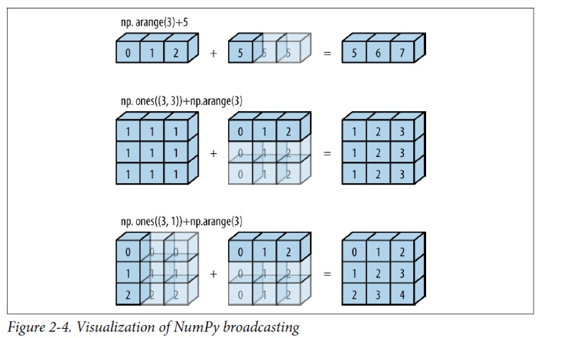

# Vectorization (Scalar Operations) and Broadcasting

A great thing about arrays is that they allow for batch operations to be carried out in a scalar capacity (meaning we can perform an operation on an array and it will be applied to each element of the array without using for loops). Let's try it out:

```
>>> banana = np.array([1, 2, 3], dtype=np.float64)
>>> print(banana)
[1. 2. 3.]
>>> banana * 10
array([10., 20., 30.])
>>> 
```
Notice that multiplying by 10 was carried out on each item in the array. 

More examples of array arithmetic: 

```
>>> banana * banana
array([1., 4., 9.])
>>> banana + banana
array([2., 4., 6.])
>>> banana2 = banana * 2
>>> print(banana2)
[2. 4. 6.]
>>> banana2 > banana
array([ True,  True,  True])
```

Above, when we multiplied by 2, or 10, that was actually a NumPy feature called **broadcasting**. Essentially, we performed operations with arrays of different sizes. 

```
>>> banana
array([1., 2., 3.])
>>> banana * 3
array([3., 6., 9.])
>>> banana3 = np.array([3, 3, 3])
>>> banana * banana3
array([3., 6., 9.])
>>> 
```

When we perform a scalar operation, the scalar value seemingly gets expanded into an array. In this case, we see this demonstrated by a 3-element array banana3. 


**The Broadcasting Rule**:  In order to broadcast, the size of the trailing axes for both arrays in an operation must either be the same size or one of them must be one. Else, you will get a "ValueError('frames are not aligned')" exception. 

Arrays banana and banana3 are compatible because both (or either) trailing axes values are 1.

```
>>> banana.shape
(3,)
>>> banana2.shape
(1,)
```

To further illustrate: 

```
>>> banana.shape
(3,)
>>> banana2.shape
(1,)
>>> apples
array([[2, 3],
       [4, 5]])
>>> apples.shape
(2, 2)
# apples and banana2 are compatible
>>> apples * banana2
array([[ 4,  6],
       [ 8, 10]])
>>> pineapples = np.array([[2, 3, 4], [5, 6, 7]])
>>> pineapples.shape
(2, 3)
# pineapples and banana2 are compatible
>>> pineapples * banana2
array([[ 4,  6,  8],
       [10, 12, 14]])
# pineapples and apples are NOT compatible
>>> pineapples * apples
Traceback (most recent call last):
  File "<stdin>", line 1, in <module>
ValueError: operands could not be broadcast together with shapes (2,3) (2,2) 
>>> 
```

Fruitstand and apples are compatible:

```
>>> fruitstand = np.array([[[2], [3]], [[4], [5]], [[6], [7]]])
>>> apples
array([[2, 3],
       [4, 5]])
>>> fruitstand.shape
(3, 2, 1)
>>> apples.shape
(2, 2)
>>> fruitstand * apples
array([[[ 4,  6],
        [12, 15]],

       [[ 8, 12],
        [20, 25]],

       [[12, 18],
        [28, 35]]])
```
NumPy documentation has excellent examples and visualizations of how the arrays are "stretched" to perform operations. [Let's head over there now to check it out!](https://numpy.org/devdocs/user/theory.broadcasting.html) 




# Universal Functions

NumPy has many universal mathematical functions as well, called **ufuncs**. These perform element-wise operations on ndarrays. 

They're fairly easy to apply, and once you get the hang of it they all work the same...

[Here is a list of current available NumPy ufuncs](https://numpy.org/doc/stable/reference/ufuncs.html#available-ufuncs)

Here we go!

```
>>> numeros = np.random.randint(10, size=10)
>>> numeros
array([3, 9, 7, 1, 8, 9, 6, 9, 5, 6])
>>> np.sum(numeros)
63
>>> np.sqrt(numeros)
array([1.73205081, 3.        , 2.64575131, 1.        , 2.82842712,
       3.        , 2.44948974, 3.        , 2.23606798, 2.44948974])
```

Here's a reciprocal function. Remember to examine your datatypes so you get the information returned you expect to get. 

```
>>> np.reciprocal(numeros)
array([0, 0, 0, 1, 0, 0, 0, 0, 0, 0])
>>> numeros.dtype
dtype('int64')
>>> numbers = np.reciprocal(numeros.astype('float64'))
>>> numbers
array([0.33333333, 0.11111111, 0.14285714, 1.        , 0.125     ,
       0.11111111, 0.16666667, 0.11111111, 0.2       , 0.16666667])
>>> 
```
As you can see, it is as easy as passing the array into the function to perform a mathematical operation:

```
>>> np.max(numeros)
9
>>> np.min(numeros)
1
>>> np.average(numeros)
6.3
```

Calculate a row or column sum:

```
>>> sully
array([[0, 0, 2],
       [0, 4, 0],
       [1, 4, 0]])
#all sum
>>> np.sum(sully)
11
#row sum
>>> np.sum(sully, axis = 1)
array([2, 4, 5])
#column sum
>>> np.sum(sully, axis = 0)
array([1, 8, 2])
#retain the 2D dimension of sully
>>> np.sum(sully, axis = 1, keepdims = True)
array([[2],
       [4],
       [5]])
```

Calculate a mean: 

```
>>> sully
array([[0, 0, 2],
       [0, 4, 0],
       [1, 4, 0]])
>>> sully.mean(axis = 0)
array([0.33333333, 2.66666667, 0.66666667])
>>> sully.mean(axis = 1)
array([0.66666667, 1.33333333, 1.66666667])
>>> 
```

# Reshaping, Transposing, and Swapping Axes

NumPy ndarrays can be given a new shape without changing its data. Reshaping creates a new view object. 

```
>>> array = np.arange(45)
>>> array
array([ 0,  1,  2,  3,  4,  5,  6,  7,  8,  9, 10, 11, 12, 13, 14, 15, 16,
       17, 18, 19, 20, 21, 22, 23, 24, 25, 26, 27, 28, 29, 30, 31, 32, 33,
       34, 35, 36, 37, 38, 39, 40, 41, 42, 43, 44])
>>> array.reshape(9, 5)
array([[ 0,  1,  2,  3,  4],
       [ 5,  6,  7,  8,  9],
       [10, 11, 12, 13, 14],
       [15, 16, 17, 18, 19],
       [20, 21, 22, 23, 24],
       [25, 26, 27, 28, 29],
       [30, 31, 32, 33, 34],
       [35, 36, 37, 38, 39],
       [40, 41, 42, 43, 44]])
>>> 
```

Remember, the first number in the tuple selects the matrix, so if we have a 1D array, the following is the same: 

```
>>> print(x)
[87 99 23  2 21 52  1 87 29 37]
>>> print(x.reshape(2, 5))
[[87 99 23  2 21]
 [52  1 87 29 37]]
>>> print(x.reshape(1, 2, 5))
[[[87 99 23  2 21]
  [52  1 87 29 37]]]
>>> 
```
Transposing uses the axis as a keyword argument. Let's flip some x's and y's to create a new view!

Transposing a 1D array returns an unchanged view of the original array:

```
>>> array = np.array([1, 2, 3])
>>> np.transpose(array)
array([1, 2, 3])
```
An example of transposing a 2D array:

```
>>> abc = np.arange(4).reshape((2, 2))
>>> abc
array([[0, 1],
       [2, 3]])
>>> np.transpose(abc)
array([[0, 2],
       [1, 3]])
>>> 
```

Transposing with more dimensions can be a real brain-teaser: 

2D: Three rows, two columns becomes two rows, three columns, or a 3x3 becomes another 3x3.

Note: We could use the array transpose method or the T attribute.

```
>>> baby = [[0,1], [2,3], [4,5]]
>>> baby = np.array(baby)
>>> baby
array([[0, 1],
       [2, 3],
       [4, 5]])
# Array transpose() function
>>> np.transpose(baby)
array([[0, 2, 4],
       [1, 3, 5]])]
# Note: baby keeps original shape & new array was created with transpose. You could store it in a varialbe if needed!
>>> baby
array([[0, 1],
       [2, 3],
       [4, 5]])
# T attribute
>>> baby.T
array([[0, 2, 4],
       [1, 3, 5]])
```
What helps me visualize this is to take a piece of printer paper and hold it so the short end is at the top, then bring the bottom left-hand corner to the top right without bending the paper. 


3D: Transpose accepts a tuple of axis numbers. Remember we have three axes represented by (matrix, row, and column) as parameters. 

```
>>> myarray
array([[[ 0,  1,  2,  3],
        [ 4,  5,  6,  7],
        [ 8,  9, 10, 11]],

       [[12, 13, 14, 15],
        [16, 17, 18, 19],
        [20, 21, 22, 23]]])
>>> myarray.transpose((1, 0, 2))
array([[[ 0,  1,  2,  3],
        [12, 13, 14, 15]],

       [[ 4,  5,  6,  7],
        [16, 17, 18, 19]],

       [[ 8,  9, 10, 11],
        [20, 21, 22, 23]]])
>>> 
```
[This question in Stack Overflow resulted in an in-depth answer about how transpose() works. Read on if you want to learn about **strides**](https://stackoverflow.com/questions/32034237/how-does-numpys-transpose-method-permute-the-axes-of-an-array).

In higher dimensions, say a 4D 2x3x4x5 array, the command array.T transposes the array into a 5x4x3x2 array. Element (i, j, k, l) in the original array maps to element (l, k, j, i) in the newly transposed array.

If we want to swap axes, there is a command for that as well: 

```
>>> blah = np.arange(16).reshape(2, 2, 4)
>>> blah
array([[[ 0,  1,  2,  3],
        [ 4,  5,  6,  7]],

       [[ 8,  9, 10, 11],
        [12, 13, 14, 15]]])
>>> blah.swapaxes(1, 2)
array([[[ 0,  4],
        [ 1,  5],
        [ 2,  6],
        [ 3,  7]],

       [[ 8, 12],
        [ 9, 13],
        [10, 14],
        [11, 15]]])
>>> blah.swapaxes(2, 0)
array([[[ 0,  8],
        [ 4, 12]],

       [[ 1,  9],
        [ 5, 13]],

       [[ 2, 10],
        [ 6, 14]],

       [[ 3, 11],
        [ 7, 15]]])
>>> 
```

# Sorting

NumPy Arrays can be sorted, just like Python lists. We have two ways of executing sorting: np.sort(array) and array.sort(). This first one produces a sorted view, while calling .sort() on the array will produce a sorted copy. Let's try it out:

```
>>> guacamole = np.array([1, 4, 2, 5, 3, 6, 4, 7, 5, 8])
>>> np.sort(guacamole)
array([1, 2, 3, 4, 4, 5, 5, 6, 7, 8])
# original guacamole is unchanged
>>> guacamole
array([1, 4, 2, 5, 3, 6, 4, 7, 5, 8])
# sort "in-place" with .sort()
>>> guacamole.sort()
#guacamole is changed
>>> guacamole
array([1, 2, 3, 4, 4, 5, 5, 6, 7, 8])
>>> 
```

If you want to sort a multidimensional array by axis, you can pass in the axis:

```
>>> gnome = np.random.randint(10, size=(6, 3))
>>> gnome
array([[7, 6, 1],
       [9, 0, 3],
       [2, 8, 5],
       [7, 9, 7],
       [0, 5, 4],
       [3, 6, 6]])
# axis=0 will sort the data in the columns
>>> np.sort(gnome, axis=0)
array([[0, 0, 1],
       [2, 5, 3],
       [3, 6, 4],
       [7, 6, 5],
       [7, 8, 6],
       [9, 9, 7]])
# gnome was unchanged, but here he is for comparison's sake
>>> gnome
array([[7, 6, 1],
       [9, 0, 3],
       [2, 8, 5],
       [7, 9, 7],
       [0, 5, 4],
       [3, 6, 6]])
# axis=1 sorts the data within the rows
>>> np.sort(gnome, axis=1)
array([[1, 6, 7],
       [0, 3, 9],
       [2, 5, 8],
       [7, 7, 9],
       [0, 4, 5],
       [3, 6, 6]])
# again, gnome was unchanged
>>> gnome
array([[7, 6, 1],
       [9, 0, 3],
       [2, 8, 5],
       [7, 9, 7],
       [0, 5, 4],
       [3, 6, 6]])
>>> 
```
We can do something similar with array.sort(), but it does change the array:

```
>>> gnome
array([[7, 6, 1],
       [9, 0, 3],
       [2, 8, 5],
       [7, 9, 7],
       [0, 5, 4],
       [3, 6, 6]])
>>> gnome.sort(0)
>>> gnome
array([[0, 0, 1],
       [2, 5, 3],
       [3, 6, 4],
       [7, 6, 5],
       [7, 8, 6],
       [9, 9, 7]])
>>> 
```

We have more capabilities with np.sort(array). [Click here for the documentation](https://numpy.org/doc/stable/reference/generated/numpy.sort.html)

We can sort with no axis, which, in effect, flattens the array:

```
>>> np.sort(gnome, axis=None)
array([0, 0, 1, 2, 3, 3, 4, 5, 5, 6, 6, 6, 7, 7, 7, 8, 9, 9])
```
Even more fun is using the **order** keyword in np.sort() on structured arrays. 

Let's revisit the grocery store, but pretend the prices are normal and it's totally acceptable to have produce in different aisles. 

```
# first we will think about the data in our list and define the datatypes
>>> our_dtypes = [('name', 'U10'), ('price', float), ('aisle', int)]
# next we'll create our grociery list with the items, prices, and locations
>>> our_list = [('celery', 3.54, 1), ('apples', 2.45, 7), ('hot chocolate', 4.67, 12), ('milk', 4.16, 11), ('pop-tarts', 6.2, 14), ('frozen pizza', 7.1, 2)]
# define the numpy array (note: we could create this directly without using the our_list and our_dtypes variables)
>>> our_structured_array = np.array(our_list, dtype=our_dtypes)
# our list has been mapped to the dataypes
>>> our_structured_array
array([('celery', 3.54,  1), ('apples', 2.45,  7),
       ('hot chocol', 4.67, 12), ('milk', 4.16, 11),
       ('pop-tarts', 6.2 , 14), ('frozen piz', 7.1 ,  2)],
      dtype=[('name', '<U10'), ('price', '<f8'), ('aisle', '<i8')])
# let's sort by name
>>> np.sort(our_structured_array, order='name')
array([('apples', 2.45,  7), ('celery', 3.54,  1),
       ('frozen piz', 7.1 ,  2), ('hot chocol', 4.67, 12),
       ('milk', 4.16, 11), ('pop-tarts', 6.2 , 14)],
      dtype=[('name', '<U10'), ('price', '<f8'), ('aisle', '<i8')])
# having our list in alphabetical order isn't really useful because if we go straight down the list, 
# we will backtrack all over the store to find our items in #different aisles. Let's sort by aisles so we can shop more efficiently:
>>> np.sort(our_structured_array, order='aisle')
array([('celery', 3.54,  1), ('frozen piz', 7.1 ,  2),
       ('apples', 2.45,  7), ('milk', 4.16, 11), ('hot chocol', 4.67, 12),
       ('pop-tarts', 6.2 , 14)],
      dtype=[('name', '<U10'), ('price', '<f8'), ('aisle', '<i8')])
>>> 
```

Our cart is full and it's time to checkout: How much will we spend? 

```
# extract the items that are mapped to 'price' 
>>> our_prices = our_structured_array['price']
>>> our_prices
array([3.54, 2.45, 4.67, 4.16, 6.2 , 7.1 ])
# perform a sum method 
>>> np.sum(our_prices)
28.119999999999997
# Of course, we don't carry around fractions of pennies on us, so we round it to two decimal places
>>> round(np.sum(our_prices), 2)
28.12
```
$28.12 for six items? Does anyone have a gift card to help out? We didn't even consider taxes! 

Discussion: Could we have used better datatypes? Yes/No/Why???

Suppose we only came prepared to spend $25 (before taxes). How can we determine which item(s) to put back? It looks like we're roughly $3 over our budget. 

Here is one way. Can you think of others?

```
>>> our_prices
array([3.54, 2.45, 4.67, 4.16, 6.2 , 7.1 ])
>>> less_than_three = our_prices < 3.12
>>> less_than_three
array([False,  True, False, False, False, False])
>>> our_prices[1]
2.45
>>> our_structured_array[1]
('apples', 2.45, 7)
>>> 
```

# Unique() and argsort()

Unique does what you'd think it does: returns the unique elements of an array.

```
# create an array, and use np.unique()
>>> lemons = np.array([2, 5, 3, 6, 4, 7, 5, 8, 6, 9, 7])
>>> print(lemons)
[2 5 3 6 4 7 5 8 6 9 7]
# unique tells you that each of these elements is in the array lemons at least once
>>> np.unique(lemons)
array([2, 3, 4, 5, 6, 7, 8, 9])
```
If we set return_index = True, unique also returns an array of where each unique element is first located. So, 2 is first located at lemons[0], while 9 is first located at lemons[9], etc. 

```
>>> np.unique(lemons, return_index = True)
(array([2, 3, 4, 5, 6, 7, 8, 9]), array([0, 2, 4, 1, 3, 5, 7, 9]))
```
If we wanted to sort the unique items by order of appearance we will use argsort() on the index array, which is then used to sort the unique array

```
>>> our_uniques = np.unique(lemons)
>>> firsts = np.unique(lemons, return_index = True)
>>> firsts
(array([2, 3, 4, 5, 6, 7, 8, 9]), array([0, 2, 4, 1, 3, 5, 7, 9]))
>>> our_uniques[np.argsort(firsts)]
array([[2, 3, 4, 5, 6, 7, 8, 9],
       [2, 5, 3, 6, 4, 7, 8, 9]])
>>> 
```

With return_counts = True, we can get a count of how many times each unique item makes an appearance in our array:

```
>>> lemons
array([2, 5, 3, 6, 4, 7, 5, 8, 6, 9, 7])
>>> np.unique(lemons, return_counts = True)
(array([2, 3, 4, 5, 6, 7, 8, 9]), array([1, 1, 1, 2, 2, 2, 1, 1]))
```

