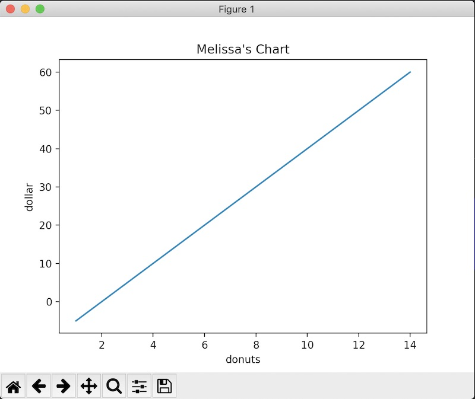

# Last night of NumPy

We've covered a lot of information, but tonight we'll keep it short to review any concepts or homework you have questions on and then tackle a larger problem as a group. 

## MatPlotLib - Visualizing data with NumPy

Instructions for installation are [here](https://matplotlib.org/stable/index.html).

If you need a quick refresher on plotting with x and y axis, look [here](https://www.hmhco.com/blog/teaching-x-and-y-axis-graph-on-coordinate-grids)

MatPlotLib is a library that lets us create visualizations from NumPy arrays, and is suitable enough for publication. We can use it to make [all kinds of eye-catching charts and graphs](https://matplotlib.org/3.3.3/gallery/index.html). The type of plot you choose will directly correlate to the data you have and the story you want to tell.

Let's do a quick MatPlotLib tutorial so I can chart the relationship between dollars and donuts in my bakery. 

Import pyplot from matplotlib and call it 'plt'. 

```
# Standard imports, per usual
import matplotlib.pyplot as plt
import numpy as np
```

```
# make a silly array
>>> x = np.arange(1, 15)
# for our demo, y can be anything (in this case, we will end up with a straight line)
>>> y = (x - 2) * 5
# give the chart a title
>>> plt.title("Melissa's Chart")
Text(0.5, 1.0, "Melissa's Chart")
# label our x and y axis
>>> plt.xlabel("donuts")
Text(0.5, 0, 'donuts')
>>> plt.ylabel("dollar")
Text(0, 0.5, 'dollar')
# tell it to plot
>>> plt.plot(x, y)
[<matplotlib.lines.Line2D object at 0x1270fc1c0>]
# tell it to display
>>> plt.show()
```

You should end up with something similar to this (yeah, my formula for pricing donuts is nuts): 




We will continue to build our MatPlotLib skills as we progress, learning about the types of plots that best suit our data and how to choose the best plot. Humans are adept at picking out visual patterns, so learning to spot areas of concern in our data and display our data properly to get our point across is imperative. 


