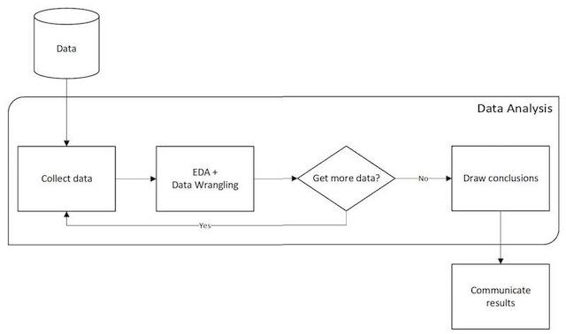
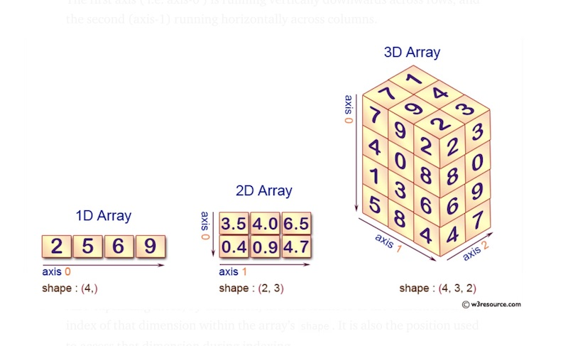

# Congratulations! 

You have reached the first night of the Data Analysis section of this class. Now that you have a grasp of the basics of the Python programming language (and if you don't, please reach out!), we can begin using that knowledge to leverage Python to work with large sets of data. 

Soon you will be well-prepared to take a set of data and turn it into a mind-blowing masterpiece of graphs and charts and communicate your findings. We'll be getting to the meat and potatoes of data analysis with Python a bit later, but first we need to discuss some basic fundamentals.

# Data Analysis Workflow

What are we going to learn in this section of the class? In what order? How do data scientists even approach their task? Well, over time an **iterative** process has been established. (Bonus: Can you tell me what 'iterative' means?) 

This process involves collecting data, preparing it, exploratory data analysis, and drawing conclusions. 

Let's look at what that process can look like: 

[Data Analysis Iteration with Roger Peng](https://www.youtube.com/watch?v=xOomNicqbkk)

Keep in mind, the process is heavily-based in data preparation and determining if the outcome of the step you took to wrangle the data meets expectations. 

1. Set expectations
2. Collect data/info
3. React to data and revise expectations if needed - What have we learned? What would we do differently next time? 

Repeat if necessary!



## Data Collection

There is no shortage of data in today's world. Shopping habits. Consumer info. Data from restaurant POS. Sports stats. Traffic studies. Population. Wall Street stocks. 

Data collection is a must-have first step as we cannot analyze data we do not have. But first we need to consider a few things:

1. What kind of data do we need? Data that is useful for our analysis. 
 
2. Where and how can we get the data?
    - Web scraping
    - APIs
    - Databases
    - Government websites
    - Financial resources
    - Log files

When it comes time to do our capstone projects, [this Dataquest link](https://www.dataquest.io/blog/free-datasets-for-projects/) is a great resource for data sets or to get some inspiration. There are many more resources like this out there on The Internets. 

Remember we are looking for data relevant to our study. If we are looking for speeds of cars, do we need to know the cars' colors? No, but relevant data might be the terrain type or weather conditions or type of fuel used or weight of the car. The data you use will depend on the story you are trying to tell. 

## Data Wrangling

But what if the data we gather isn't perfect? No worries. There are processes used to get it into a workable format suitable for data analysis. Using these processes and cleaning data is called Data Wrangling, and will deliver the data in a new format better suited for analytic operations.

[More info on Data Wrangling](https://www.trifacta.com/data-wrangling/)

How can data be "dirty"???

	- Inconsistencies: STL instead of St. Louis or Saint Louis, or stl
	- Typos: What can a misplaced decimal point do?
	- Missing entries
	- Time/Date formats: military time, time zones, dd/mm/yy versus mm/dd/yyyy, etc.
	- Incomplete information: Think about optional questions in a survey. How would those have been recorded to your data set?
	- Proper scale or resolution: We need cups, not gallons so we will have to calculate corrections. 
	- Irrelevant fields: quantitative versus qualitative, is it needed?
	- Format: We're looking for beeps, not boops, or maybe long to wide form
	- Data recording process was "messed up": maybe it was recorded in the wrong order and we're looking at a descending timeline instead of an ascending one

Brain exercise: What are some data quality issues that cannot be fixed?

## Exploratory Data Analysis

We'll do some summary statistics and visualizations to help us get an idea of what the data is trying to tell us. 

The statistics will help us understand the data.
The visualizations may tell us the data needs more cleaning.

## Drawing Conclusions

Examine our findings and determine next steps. At this point in our analysis, we may decide we need more data, or a different kind of data.

This data is trying to tell us a story. Did we see any patterns or relationships?
Does it answer our questions or give insight to our problem? 

# Statistics and Analytics

There are two main types of statistics: Descriptive and Inferential. 

**Descriptive statistics** summarizes features about a data set, called a sample. With descriptive statistics, there is no uncertainty because you are describing only the people or items that you actually measure. There is no guessing or reading between the lines to apply conclusions to a larger population. 

**Inferential statistics** takes smaller, pieces of data from a sample and draws conclusions about the larger population from which the sample was drawn. 

This course uses descriptive statistics (Breathe a sigh of relief!) and terms and mathematical techniques you are probably already familiar with. Here is a good review: [Descriptive Stats Summary](https://baselinesupport.campuslabs.com/hc/en-us/articles/204305665-Types-of-Descriptive-Statistics)


There are three main types of analytics: Descriptive, Predictive, and Prescriptive. 

**Descriptive analytics** looks at data statistically to tell what happened in the past. (If we want to know WHY it happened, we call that **Diagnostic analytics**.)

**Predictive analytics** takes historical data and feeds it into a machine learning model. Whatever the machine learning model learns can be applied to new data to make predictions

**Prescriptive analytics** takes predictions from predictive analytics, and suggests potential actions and their implications.


You can get a good overview here: 
[YouTube user RichardOnData gives an overview of analytics](https://youtu.be/-U_xkc5HeoU)

# Let's Get Started

## Virtual Environments

[A Virtual Environments Primer](https://realpython.com/python-virtual-environments-a-primer/).

We'll be using [Conda](https://docs.conda.io/en/latest/).

[Quick Install](https://dev.to/bowmanjd/python-tools-for-managing-virtual-environments-3bko#conda).

A **virtual environment** according to documentation: "A virtual environment is a Python environment such that the Python interpreter, libraries and scripts installed into it are isolated from those installed in other virtual environments, and (by default) any libraries installed in a “system” Python, i.e., one which is installed as part of your operating system.
A virtual environment is a directory tree which contains Python executable files and other files which indicate that it is a virtual environment."

## NumPy - Numerical Python

NumPy is not part of a basic Python installation, and must be installed after Python. 

[Install NumPy](https://numpy.org/install/)

Most programming languages have external libraries of pre-written code that can be imported. What libraries have you already worked with in your Python learning journey? 

**NumPy** is a Python library that allows us to work with numerical data through arrays. 

### Why are we using NumPy? Can't I just use normal python lists?

Well, you could, but NumPy is more efficient in how it stores data, and it performs mathematical functions through API functions you wouldn't want to take the time to write yourself from scratch. The most important feature of NumPy is the ability to use NumPy arrays, which allow us to store large amounts of data in objects. 

Let's take a look at the memory aspect: 

```
>>> import numpy as np
>>> import sys
>>> py_array = [1, 2, 3, 4, 5, 6, 7]
>>> py_array_size = sys.getsizeof(1) * len(py_array)
>>> numpy_array = np.array([1, 2, 3, 4, 5, 6, 7])
>>> numpy_array_size = numpy_array.itemsize * numpy_array.size
>>> sys.stdout.write(str(numpy_array_size))
>>> sys.stdout.write(str(py_array_size))
```
How do the sizes compare? What do you think will happen when we examine performance speed?

```
# importing required packages
import numpy
import time
 
# size of arrays and lists
size = 1000000  
 
# declaring lists
list1 = range(size)
list2 = range(size)
 
# declaring arrays
array1 = numpy.arange(size)  
array2 = numpy.arange(size)
 
# list
initialTime = time.time()
resultantList = [(a * b) for a, b in zip(list1, list2)]
 
# calculating execution time
print("Time taken by Lists :", 
      (time.time() - initialTime),
      "seconds")
 
# NumPy array
initialTime = time.time()
resultantArray = array1 * array2
 
# calculating execution time 
print("Time taken by NumPy Arrays :",
      (time.time() - initialTime),
      "seconds")
```
NumPy algorithms are typically 10-100 times faster than corresponding python functions and use less memory. 

Why does NumPy perform better? Well, 
1. Scale: NumPy performs computations on entire arrays without the need for python 'for' loops. It has the ability to break down a task into multiple fragments and process those fragments in parallel (at the same time).  
2. Memory: An array is a collection of same datatypes that are stored in contiguous memory locations, while a Python list is a collection of heterogeneous data types stored in distant memory locations.
3. NumPy function are implemented in C language, which is faster.

[Further reading on NumPy speed](https://towardsdatascience.com/how-fast-numpy-really-is-e9111df44347#:~:text=Because%20the%20Numpy%20array%20is,leap%20in%20terms%20of%20speed.)

# NumPy ndarray

The first item on our agenda is to make NumPy accessible in our code. We do this by using an import statement:

```
import numpy as np
```

NumPy is typically shortened to 'np' as a reference to keep it standardized (and short!).

Let's talk more about arrays. You can think of an array as a grid of values, and you might hear an array referred to as an **'ndarray'** which means "N-dimensional array" where n is the number of dimensions. You might see a 1D (one-dimensional) array referred to as a vector, and a 2D (two-dimensional) array referred to as a matrix. A matrix is a special case of 2D array where each data element is of the exact same size. So every matrix is also a two dimensional array but not vice versa. A tensor refers to any array 3D or higher. In Python, any table can be represented as a list of lists, and that is important to how we will be storing and manipulating data in this class. 

Think of a 1-D array as a representation of a row of data with x columns. It's essentially a list. 
Let's create a 1D NumPy array from a python list: 

```
#import the numpy module
import numpy as np

#this is our python list
speeds_list = [45.1, 56.2, 64.1, 12.3]

#transform our list into a NumPy array by using np.array() and save it to a new variable
speeds_array = np.array(speeds_list)

#check our work
print(speeds_array)
```

A 2D array is a list of lists. The element at each index contains a 1D array. It could represent multiple rows of x columns. Let's create a 2D NumPy array from a list of lists:

```
import numpy as np

# here is our list of lists
lists = [[77, 88, 99] , [31,42,63] , [11,22,33]]

#transform the list to an array
npArray = np.array(lists)

#check our work
print(npArray)
```

A 3D arrays are arrays of arrays and there is no limit to how far they are nested.
Let's repeat the exercise for a 3D NumPy array. 

```
import numpy as np
# here is our 3D list
list = [[[1, 2], [3, 4]], [[5, 6], [7, 8]]]

#transformation
npArray = np.array(list)

#check our work
print(npArray)

```




Each array has attributes **ndim** (the number of dimensions), **shape** (the size of each dimension), and **size** (the total size of the array):

Let's examine our 3D np array we just made:

```
>>> print(npArray)
[[[1 2]
  [3 4]]
  
 [[5 6]
  [7 8]]]
>>> print(npArray.ndim)
3
>>> print(npArray.shape)
(2, 2, 2)
>>> print(npArray.size)
8
```
Also common is data type, or **dtype**:

```
>>> print(myarray.dtype)
int64
```

Since NumPy is focused on numeric computations, the dtype will most often be 'float64' unless otherwise specified.

We can specify the dtype when creating the array. This is particularly helpful when we want to store large amounts of data and storage space is an issue; it's nice to know we have control over the data type:

```
>>> banana = np.array([1, 2, 3], dtype=np.float64)
>>> print(banana)
[1. 2. 3.]
>>> 
```
Notice banana was created using integers, but came out as floats. We can also use **astype** to convert dtypes of arrays. 

```
>>> banana.dtype
dtype('float64')
>>> banana2 = banana.astype(np.int64)
>>> banana2
array([1, 2, 3])
>>> banana
array([1., 2., 3.])
```


We can also use a "random" number generator to create a list. NumPy has a "pseudorandom" number generator. Pseudorandom means it is not truly random and the data set is generated off of a written algorithm. To generate truly random numbers, you would need a data set of truly random numbers and run an algorithm based on that set of numbers. 

Generate a random integer from 0 to 100 using randint():

```
from numpy import random

x = random.randint(100)

print(x)
```

To generate a random float from 0 to 1, use rand():

```
from numpy import random

x = random.rand()

print(x)
```
To generate an array of 5 random floats from 0 to 1, use rand(5):

```
from numpy import random

x = random.rand(5)

print(x)
```

Generate a 2-D array with 6 rows, each row containing 5 random numbers:

```
from numpy import random

x = random.rand(6, 5)

print(x)
```

We can also make random arrays with NumPy's random.randint() feature. We seed with a set value in order to ensure that the same random arrays are generated each time this code is run:

```
np.random.seed(0)  # seed for reproducibility

x1 = np.random.randint(10, size=6)  # One-dimensional array
x2 = np.random.randint(10, size=(3, 4))  # Two-dimensional array
x3 = np.random.randint(10, size=(3, 4, 5))  # Three-dimensional array
```
What did the output of the above look like? 

Let's break down what we did with the randint() function:

Array x1 gave us one dimension: a list of 6 integers, all with values under 10.

Array x2 returned a 2d array: The first dimension had 3 entries, and the nested 2nd dimension had 4. Think of it as 3 rows and 4 columns, all with values under 10.  

Array x3 returned a 3d array; The first dimension had 3 entries, the 2nd had 4 entries, and the 3rd had 5 entries, all with values under 10.

Another fun number generator is to use random range, where we pass in the range and array size:

```
>>> rand_generator = np.random.default_rng()
>>> snowflakes = rand_generator.integers(15, size=10)
>>> snowflakes
array([ 4,  2,  0,  0, 14,  3,  1,  2,  4,  2])
>>> snowflakes2 = rand_generator.integers(5, size=3)
>>> snowflakes2
array([0, 3, 0])
>>> 
```

Another fun way to learn more about the shape of a NumPy array is to use NumPy zeros. It will create an array of zeros with the given shape, dtype, and order.

Give it a length or a tuple:

```
>>> car = np.zeros(10)
>>> print(car)
[0. 0. 0. 0. 0. 0. 0. 0. 0. 0.]
>>> 
```

```
>>> candy = np.zeros((5, 5, 2))
>>> print(candy)
[[[0. 0.]
  [0. 0.]
  [0. 0.]
  [0. 0.]
  [0. 0.]]

 [[0. 0.]
  [0. 0.]
  [0. 0.]
  [0. 0.]
  [0. 0.]]

 [[0. 0.]
  [0. 0.]
  [0. 0.]
  [0. 0.]
  [0. 0.]]

 [[0. 0.]
  [0. 0.]
  [0. 0.]
  [0. 0.]
  [0. 0.]]

 [[0. 0.]
  [0. 0.]
  [0. 0.]
  [0. 0.]
  [0. 0.]]]
```


Try it for yourself! The documentation can be found [here](https://numpy.org/devdocs/reference/generated/numpy.zeros.html)

We can also create empty arrays (np.empty()), or arrays with ones (np.ones()).

Another way to spin up an array is to use **arange** which is like using python's range function to generate the data:

```
>>> np.arange(15)
array([ 0,  1,  2,  3,  4,  5,  6,  7,  8,  9, 10, 11, 12, 13, 14])
```

