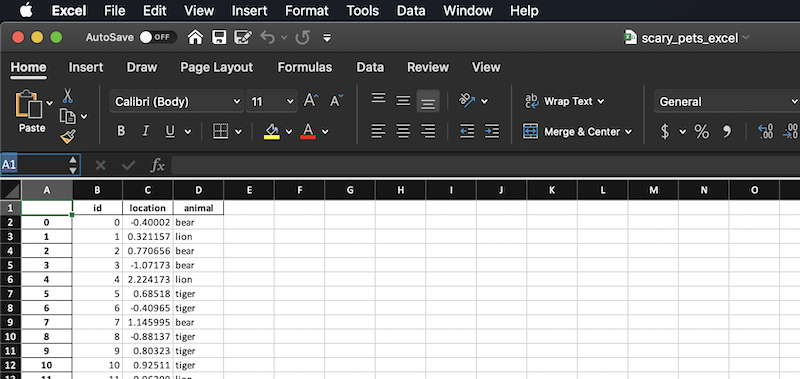

# Reading, Importing, and Writing Files Using Pandas

Now that you know how to work with smaller Series and DataFrames, we're going to switch gears a bit and learn to import larger files in formats you will encounter in the wild. Often, the data we want to analyze will most often come from outside of Python, and we will have to convert them to a workable format. These file types can contain a high volume of data. It will be good to learn using these types of files, to earn your own trust in your data manipulation abilities and practice real-life data analysis scenarios to assist in data science or business analysis. 

## Tabular Data

We may have mentioned Tabular Data before, and you'll see it as you do your own research on the Internet, but let's give it a proper definition:

Tabular data is data that is structured into rows/columns, like a table. Columns and rows are identified by headers/labels that explain the data located therein.  

## CSV Files

Need to import a CSV? Wait... what is a CSV? CSV is an acronym for Comma Separated Values, and may sometimes be referred to as Comma Delimited Files ("Delimited" is another way of saying "separated"). A CSV is a plain text file that contains a list of data and are often used for exchanging data between different types of applications. For example, I can convert Microsoft Excel files (or even Google Spreadsheets) to CSV files and then import them as CSV into other applications. Considering how popular Excel is, knowing how to import CSV files is pretty handy. 

As expected, commas are used to delimit (separate) the data, but sometimes other characters, such as semicolons or spaces, can be used. 


Let's practice with a smaller file, first. In the folder Practice Files, you should find a file called "bunchofnumbers.csv". 

If you've downloaded these files into a folder, you'll need to check where are located so you provide the proper path to tell pandas where to look for the CSV file. 

We can import 'os' to check our operating system's current working directory to determine the path we need to supply to the file. In my case, I am working in SavvyDAPython, and the file is located within the PracticeFiles subfolder. You can store your files wherever you'd like, but if you get errors telling you the file doesn't exist, it's a good idea to check your path. Going forward, I will only point to the file itself and let you figure out the proper path.

First, open the file in a text editor and examine it so you know what to expect of your new DataFrame. 

Let's make a DataFrame out of our CSV:


```
>>> import os
>>> os.getcwd()
'/Users/me/SavvyPython/SavvyDAPython'
>>> df = pd.read_csv('PracticeFiles/bunchofnumbers.csv')
>>> df
     Unnamed: 0  data
0             0     0
1             1     1
2             2     2
3             3     3
4             4     4
..          ...   ...
995         995   995
996         996   996
997         997   997
998         998   998
999         999   999
[1000 rows x 2 columns]
```

Side question: Can anyone guess what **cwd** stands for? 

We read a file with 1000 rows with two columns, so it's larger than we are used to. When we first create the DataFrame it will give us a preview of the first and last rows, but we can use **.head()** to get a preview of the first five rows, specifically:

```
>>> df.head()
   Unnamed: 0  data
0           0     0
1           1     1
2           2     2
3           3     3
4           4     4
>>> 
```

Pretty cool, right? 

Question: If you had a DataFrame with 1000 rows, and you wanted the first 30 rows, how do you think you would do it?

```
>>> df.head(30)
    Unnamed: 0  data
0            0     0
1            1     1
2            2     2
3            3     3
4            4     4
5            5     5
6            6     6
7            7     7
8            8     8
9            9     9
10          10    10
11          11    11
12          12    12
13          13    13
14          14    14
15          15    15
16          16    16
17          17    17
18          18    18
19          19    19
20          20    20
21          21    21
22          22    22
23          23    23
24          24    24
25          25    25
26          26    26
27          27    27
28          28    28
29          29    29
```

Question: what do you think **.tail()** does? Go ahead and try it! 

Fun fact: These methods also work on Series. 

## DataFrame to CSV

Sometimes you'll need to convert DataFrames to CSV files for exporting purposes, i.e you need to move your work to another software because of your co-worker who refuses to learn Pandas. 

Let's create a generic DataFrame, but a little bigger this time:

```
>>> our_new_df = pd.DataFrame({'id': np.arange(1000), 'location':np.random.normal(size=1000), 'animal':pd.Series(np.random.choice(['lion', 'tiger', 'bear'], size=1000, replace=True), dtype="string")})
>>> print(our_new_df)
      id  location animal
0      0  1.098952   lion
1      1 -1.112979   lion
2      2  0.228454   lion
3      3  0.299128   lion
4      4  0.181097  tiger
..   ...       ...    ...
995  995  0.049029   bear
996  996  0.188222   bear
997  997  0.473430   lion
998  998  0.908793   lion
999  999 -0.635300   bear

[1000 rows x 3 columns]
>>> 
```

It's simple to write this DataFrame to a CSV. There is a built-in method **DataFrame.to_csv()** you can use, supplying a name for the file as follows:

```
>>> our_new_df.to_csv('scary_pets.csv')
```

The file will get written to your Current Working Directory (Remember, that's what the **cwd** abbreviation is for). You can always supply the path with the **path_or_buff** parameter, if you'd like to save it somewhere else. Make sure the pathway exists or you'll get an error!


```
>>> our_new_df.to_csv(path_or_buff='/home/files_for_coworker_who_will_not_learn_pandas/scary_pets.csv')
```

Let's open our new CSV file in a text editor. 

(Mine opened in Numbers because I'm using a Mac... Your file may look different, depending on what OS/software you choose to use.)


By default, **to_csv()** assigns an index, but we often won't want it. We can get around it by passing **index=false**. 


```
>>> our_new_df.to_csv('scary_pets2.csv', index=False)
```

Let's open our 2nd CSV to make a comparison:


As you can see, the index column was not created. 

There are more parameters for **to_csv()** and can be found [here](https://pandas.pydata.org/pandas-docs/stable/reference/api/pandas.DataFrame.to_csv.html). Feel free to play around. 

Just for fun/practice... Convert our scary pets CSV to a DataFrame! 
Bonus: Try passing different parameters from the **read_csv()** documentation found [here](https://pandas.pydata.org/pandas-docs/stable/reference/api/pandas.read_csv.html#pandas.read_csv)

## Missing Data in CSV

When you save your DataFrame to a CSV file, any missing data will be represented by empty strings (''). You can customize how you would like an empty cell to appear with **na_rep**:

```
>>> our_new_df.to_csv('scary_pets2.csv', index=False, na_rep='**empty**')
```
In this example, any empty strings (''), 'nan', '-nan', 'NA', 'N/A', 'NaN', 'null', etc, will now have the value of "**empty**". Of course, our dataframe didn't have any missing data. We'll surely get to use this later! 


## DataFrame to Excel

If you need to convert your DataFrame straight to Excel, we can do that with **to_Excel()**, which is found [here](https://pandas.pydata.org/pandas-docs/stable/reference/api/pandas.DataFrame.to_excel.html#pandas.DataFrame.to_excel).

Although there are a whole host of parameters to pass to customize the Excel output, the bare minimum is the file name:

```
>>> our_new_df.to_excel('scary_pets_excel.xlsx')
Traceback (most recent call last):
  File "<stdin>", line 1, in <module>
  File "/Users/melissapabst/miniconda3/envs/dapenv/lib/python3.8/site-packages/pandas/core/generic.py", line 2188, in to_excel
    formatter.write(
  File "/Users/melissapabst/miniconda3/envs/dapenv/lib/python3.8/site-packages/pandas/io/formats/excel.py", line 815, in write
    writer = ExcelWriter(  # type: ignore[abstract]
  File "/Users/melissapabst/miniconda3/envs/dapenv/lib/python3.8/site-packages/pandas/io/excel/_openpyxl.py", line 28, in __init__
    from openpyxl.workbook import Workbook
ModuleNotFoundError: No module named 'openpyxl'
>>> 
```

OH NO! An error. A quick google of "ModuleNotFoundError: No module named 'openpyxl'" shows us that we need to install the 'openpyxl' module. Let's use our dependency manager to make sure we get the right version:

```
conda install openpyxl
Fetching package metadata ...........
Solving package specifications: .

Package plan for installation in environment /Users/melissapabst/miniconda3/envs/dapenv:

The following NEW packages will be INSTALLED:

    et_xmlfile: 1.0.1-py_1001     
    jdcal:      1.4.1-py_0        
    openpyxl:   3.0.7-pyhd3eb1b0_0

Proceed ([y]/n)? y
```

After a successful installation, we can use openpyxl to write CSV to Excel formats. 

```
>>> our_new_df.to_excel('scary_pets_excel.xlsx')
>>> 
```

Yay! No issues, and the file was created in my current working directory. 



Again, it has that pesky index, so you can try on your own to set the index=false, as we have done with other Pandas objects. 

Other fun parameters include naming the starting row/column where you want the data to appear, freezing panes, how to represent missing data, and how to round/format data. 

## JSON files

JSON stands for JavaScript Object Notation. These types of files are plaintext (text-only) files and meant for easy human reading. Because of the text format, code can be written in any programming language to read or write them. Lucky for us! We can use them with Python Pandas! JSON data is written as name/value pairs. While it can be technically be used for data storage, JSON files are primarily used for serialization and information exchange between a client and server.


Below is an example of a JSON file. This example defines a "users" object, which is an array of 5 user records (objects). How does this data translate to a table? Meaning, if you had to arrange this data as a table, what are the rows? What are the columns?


## JSON to DataFrame

We can read JSON files with **read_json()**. Again, just supply a filename. Documentation can be found [here](https://pandas.pydata.org/docs/reference/api/pandas.read_json.html):


```
>>> jsondf = pd.read_json('practice.json')
>>> print(jsondf)
                                               users
0  {'userId': 1, 'firstName': 'Krish', 'lastName'...
1  {'userId': 2, 'firstName': 'racks', 'lastName'...
2  {'userId': 3, 'firstName': 'denial', 'lastName...
3  {'userId': 4, 'firstName': 'devid', 'lastName'...
4  {'userId': 5, 'firstName': 'jone', 'lastName':...
>>> 
```

## DataFrame to JSON

There's also a function to convert your DataFrame to JSON. You might need to do this if your data needs to be formatted to be fed into a website... and read via JavaScript! As always, read the [documentation](https://pandas.pydata.org/docs/reference/api/pandas.DataFrame.to_json.html#pandas.DataFrame.to_json).


```
>>> our_new_df.to_json('our_new_df.json')
>>> 
```

Go ahead and open your newly created file. Your instructor will wait patiently. :)

Either you'll see something like below, or yours might appear as a straight line, depending on what editor you are using. 


Why do you think that is? Well, you might need to install a JSON editor specific to your IDE to make it readable. 

**OR** use an online formatter! [Check it out](https://www.freeformatter.com/json-formatter.html)

**OR** you can drag the file into your web browser! Give it a try. Pretty cool tricks, huh?

JSON is tricksy, Precious. 

## Other file types

While CSV, Excel, and JSON files are probably the most common, other data formats exist. 

You might be given file types of .txt, HTML, or even a Python pickle file (yeah, that's a real thing!), so it's just a matter of looking up the methods needed to work with those kinds of files. [Here is a good place to get started](https://pandas.pydata.org/pandas-docs/stable/user_guide/io.html).

## Data Dump

Getting data from outside Python is commonly referred to as a **data dump**, and happens often when files are obtained via and API or a database, versus someone conveniently (and kindly!) handing us a file. The reason for the "data dump" verbiage is that the incoming file is often a very large amount of data, with varying degrees of granularity, and none of it has been sorted out. It can be useful to our analysis, and it is our job to sift through it to make those determinations depending on the questions we need to answer. 


### Data from a Database

Note: SQL = Structured Query Language and is used to query databases.

Pandas has the built-in ability to interact with SQLite, and the installation of SQLAlchemy allows us to interact with other types of databases. 

This is kind of what it would look like should we want to write "scary_pets.csv" to a  database called "animals" as a table called "nightmares":

```
>>> import sqlite3
>>> with sqlite3.connect('animals.db') as connection: pd.read_csv('PracticeFiles/scary_pets.csv).to_sql('nightmares', connection, index=False, if_exists='replace')
```
Getting data from the database involves the use of SQL queries. Retrieving our "nightmares" table data would look similar to this: 

```
>>> with sqlite3.connect('animals.db') as connection: scary_pets = pd.read_sql('SELECT * FROM nightmares', connection)
```

And that's the gist of our query. We went to animals database, and read ALL data from the SQL table "nightmares" and stored it in a scary_pets DataFrame. 

### Data from an API

Sometimes we will need to retrieve data from online resources. Let's examine how to do that:

1. We will be making a GET request. GET is an HTTP method that tells a server we want to read some data. If the server requires authentication, we will make a POST request. Information about HTTP requests can be found [here](https://developer.mozilla.org/en-US/docs/Web/HTTP/Methods).
2. We will need the URL/endpoint of the API where we access the data.
3. We need the Python requests module in order to make API calls... You should know the drill by now. Documentation can be found [here](https://docs.python-requests.org/en/master/):


```
 conda install requests
```

Let's work with an API that does not require authentication, for ease of practice. 

A recently published list of fun API's with no auth can be found [here](https://mixedanalytics.com/blog/list-actually-free-open-no-auth-needed-apis/). 

I chose to work with data from [Cat Facts](https://cat-fact.herokuapp.com/#/). The GitHub Page is [here](https://alexwohlbruck.github.io/cat-facts/). The API documentation for Cat Facts is [here](https://alexwohlbruck.github.io/cat-facts/docs/). 


Our base URL for our data fetch will be "https://cat-fact.herokuapp.com", and we will add the endpoint of "/facts" because we want ALL the cat facts. 

We'll import requests, and then check to make sure the HTTP status code of the request is a 200, which signifies the API is operational and everything is okay. We'll then format the response as JSON, and examine the response. 

```
>>> import requests
>>> url = 'https://cat-fact.herokuapp.com/facts'
>>> response = requests.get(url)
>>> response
<Response [200]>
>>> response = requests.get(url).json()
>>> response
[{'status': {'verified': True, 'sentCount': 1}, 'type': 'cat', 'deleted': False, '_id': '58e008800aac31001185ed07', 'user': '58e007480aac31001185ecef', 'text': 'Wikipedia has a recording of a cat meowing, because why not?', '__v': 0, 'source': 'user', 'updatedAt': '2020-08-23T20:20:01.611Z', 'createdAt': '2018-03-06T21:20:03.505Z', 'used': False}, {'status': {'verified': True, 'sentCount': 1}, 'type': 'cat', 'deleted': False, '_id': '58e008630aac31001185ed01', 'user': '58e007480aac31001185ecef', 'text': 'When cats grimace, they are usually "taste-scenting." They have an extra organ that, with some breathing control, allows the cats to taste-sense the air.', '__v': 0, 'source': 'user', 'updatedAt': '2020-08-23T20:20:01.611Z', 'createdAt': '2018-02-07T21:20:02.903Z', 'used': False}, {'status': {'verified': True, 'sentCount': 1}, 'type': 'cat', 'deleted': False, '_id': '58e00a090aac31001185ed16', 'user': '58e007480aac31001185ecef', 'text': 'Cats make more than 100 different sounds whereas dogs make around 10.', '__v': 0, 'source': 'user', 'updatedAt': '2020-08-23T20:20:01.611Z', 'createdAt': '2018-02-11T21:20:03.745Z', 'used': False}, {'status': {'verified': True, 'sentCount': 1}, 'type': 'cat', 'deleted': False, '_id': '58e009390aac31001185ed10', 'user': '58e007480aac31001185ecef', 'text': "Most cats are lactose intolerant, and milk can cause painful stomach cramps and diarrhea. It's best to forego the milk and just give your cat the standard: clean, cool drinking water.", '__v': 0, 'source': 'user', 'updatedAt': '2020-08-23T20:20:01.611Z', 'createdAt': '2018-03-04T21:20:02.979Z', 'used': False}, {'status': {'verified': True, 'sentCount': 1}, 'type': 'cat', 'deleted': False, '_id': '58e008780aac31001185ed05', 'user': '58e007480aac31001185ecef', 'text': 'Owning a cat can reduce the risk of stroke and heart attack by a third.', '__v': 0, 'source': 'user', 'updatedAt': '2020-08-23T20:20:01.611Z', 'createdAt': '2018-03-29T20:20:03.844Z', 'used': False}]
>>> 
```

Great, but how do we unpack that??? We can look at the keys to look at how the data is structured:  


```
>>> response.keys()
Traceback (most recent call last):
  File "<stdin>", line 1, in <module>
AttributeError: 'list' object has no attribute 'keys'
```


UM WHAT?? An error? Sigh. We just tried to get keys from a Python list object. Let's try using a URL that has a single cat fact as an endpoint. 


```
>>> url = 'https://cat-fact.herokuapp.com/facts/random'
>>> response = requests.get(url)
>>> response
<Response [200]>
>>> response.json()
{'status': {'verified': True, 'sentCount': 1}, 'type': 'cat', 'deleted': False, '_id': '58e00b4d0aac31001185ed22', 'user': '58e007480aac31001185ecef', 'text': 'Original kitty litter was made out of sand but it was replaced by more absorbent clay in 1948.', '__v': 0, 'source': 'user', 'updatedAt': '2020-08-23T20:20:01.611Z', 'createdAt': '2018-01-13T21:20:04.481Z', 'used': False}
>>> response.json().keys()
dict_keys(['status', 'type', 'deleted', '_id', 'user', 'text', '__v', 'source', 'updatedAt', 'createdAt', 'used'])
>>> 
```

Then we can investigate the data in that one single cat fact by looking at the types of data stored in a key:

```
>>> catfacts_json = response.json()
>>> type(catfacts_json['_id'])
<class 'str'>
>>> type(catfacts_json['status'])
<class 'dict'>
>>> 
```

We can use the keys to extract data from the response object: 

```
>>> catfacts_json['status']
{'verified': True, 'sentCount': 1}
>>> catfacts_json['status']['verified']
>>> True
>>> catfacts_json['text']
'Original kitty litter was made out of sand but it was replaced by more absorbent clay in 1948.'
>>> 
```

Now that you're warmed up with API's, let's look at one that is a little meatier. This API returns the most 30 recent [open issues for pandas on GitHub](https://github.com/pandas-dev/pandas/issues) (Shame! Someone needs to get on those!):


```
>>> url = 'https://api.github.com/repos/pandas-dev/pandas/issues'
>>> response = requests.get(url)
>>> response
<Response [200]>
>>> issues_data = response.json()
```

Let's examine the GitHub issues to see what the first one looks like: 

```
>>> issues_data[0]
{'url': 'https://api.github.com/repos/pandas-dev/pandas/issues/40672', 'repository_url': 'https://api.github.com/repos/pandas-dev/pandas', 'labels_url': 'https://api.github.com/repos/pandas-dev/pandas/issues/40672/labels{/name}', 'comments_url': 'https://api.github.com/repos/pandas-dev/pandas/issues/40672/comments', 'events_url': 'https://api.github.com/repos/pandas-dev/pandas/issues/40672/events', 'html_url': 'https://github.com/pandas-dev/pandas/pull/40672', 'id': 842874460, 'node_id': 'MDExOlB1bGxSZXF1ZXN0NjAyMzQzNDI0', 'number': 40672, 'title': 'REF: _cython_operation handle values.ndim==1 case up-front', 'user': {'login': 'jbrockmendel', 'id': 8078968, 'node_id': 'MDQ6VXNlcjgwNzg5Njg=', 'avatar_url': 'https://avatars.githubusercontent.com/u/8078968?v=4', 'gravatar_id': '', 'url': 'https://api.github.com/users/jbrockmendel', 'html_url': 'https://github.com/jbrockmendel', 'followers_url': 'https://api.github.com/users/jbrockmendel/followers', 'following_url': 'https://api.github.com/users/jbrockmendel/following{/other_user}', 'gists_url': 'https://api.github.com/users/jbrockmendel/gists{/gist_id}', 'starred_url': 'https://api.github.com/users/jbrockmendel/starred{/owner}{/repo}', 'subscriptions_url': 'https://api.github.com/users/jbrockmendel/subscriptions', 'organizations_url': 'https://api.github.com/users/jbrockmendel/orgs', 'repos_url': 'https://api.github.com/users/jbrockmendel/repos', 'events_url': 'https://api.github.com/users/jbrockmendel/events{/privacy}', 'received_events_url': 'https://api.github.com/users/jbrockmendel/received_events', 'type': 'User', 'site_admin': False}, 'labels': [], 'state': 'open', 'locked': False, 'assignee': None, 'assignees': [], 'milestone': None, 'comments': 0, 'created_at': '2021-03-29T00:37:08Z', 'updated_at': '2021-03-29T00:37:08Z', 'closed_at': None, 'author_association': 'MEMBER', 'active_lock_reason': None, 'pull_request': {'url': 'https://api.github.com/repos/pandas-dev/pandas/pulls/40672', 'html_url': 'https://github.com/pandas-dev/pandas/pull/40672', 'diff_url': 'https://github.com/pandas-dev/pandas/pull/40672.diff', 'patch_url': 'https://github.com/pandas-dev/pandas/pull/40672.patch'}, 'body': '- [ ] closes #xxxx\r\n- [ ] tests added / passed\r\n- [ ] Ensure all linting tests pass, see [here](https://pandas.pydata.org/pandas-docs/dev/development/contributing.html#code-standards) for how to run them\r\n- [ ] whatsnew entry\r\n', 'performed_via_github_app': None}
```

Whoa! That's a lot of data. Let's put it in a DataFrame!


```
>>> issues_df = pd.DataFrame(issues_data)
>>> issues_df
                                                  url  ... performed_via_github_app
0   https://api.github.com/repos/pandas-dev/pandas...  ...                     None
1   https://api.github.com/repos/pandas-dev/pandas...  ...                     None
2   https://api.github.com/repos/pandas-dev/pandas...  ...                     None
3   https://api.github.com/repos/pandas-dev/pandas...  ...                     None
4   https://api.github.com/repos/pandas-dev/pandas...  ...                     None
5   https://api.github.com/repos/pandas-dev/pandas...  ...                     None
6   https://api.github.com/repos/pandas-dev/pandas...  ...                     None
7   https://api.github.com/repos/pandas-dev/pandas...  ...                     None
8   https://api.github.com/repos/pandas-dev/pandas...  ...                     None
9   https://api.github.com/repos/pandas-dev/pandas...  ...                     None
10  https://api.github.com/repos/pandas-dev/pandas...  ...                     None
11  https://api.github.com/repos/pandas-dev/pandas...  ...                     None
12  https://api.github.com/repos/pandas-dev/pandas...  ...                     None
13  https://api.github.com/repos/pandas-dev/pandas...  ...                     None
14  https://api.github.com/repos/pandas-dev/pandas...  ...                     None
15  https://api.github.com/repos/pandas-dev/pandas...  ...                     None
16  https://api.github.com/repos/pandas-dev/pandas...  ...                     None
17  https://api.github.com/repos/pandas-dev/pandas...  ...                     None
18  https://api.github.com/repos/pandas-dev/pandas...  ...                     None
19  https://api.github.com/repos/pandas-dev/pandas...  ...                     None
20  https://api.github.com/repos/pandas-dev/pandas...  ...                     None
21  https://api.github.com/repos/pandas-dev/pandas...  ...                     None
22  https://api.github.com/repos/pandas-dev/pandas...  ...                     None
23  https://api.github.com/repos/pandas-dev/pandas...  ...                     None
24  https://api.github.com/repos/pandas-dev/pandas...  ...                     None
25  https://api.github.com/repos/pandas-dev/pandas...  ...                     None
26  https://api.github.com/repos/pandas-dev/pandas...  ...                     None
27  https://api.github.com/repos/pandas-dev/pandas...  ...                     None
28  https://api.github.com/repos/pandas-dev/pandas...  ...                     None
29  https://api.github.com/repos/pandas-dev/pandas...  ...                     None

[30 rows x 26 columns]
>>> 
```

Let's revisit Cat Facts and feel a little bit better about life:

```
>>> url = 'https://cat-fact.herokuapp.com/facts'
>>> response = requests.get(url)
>>> response
<Response [200]>
>>> catfacts_json = response.json()
>>> catfacts_json[0]
{'status': {'verified': True, 'sentCount': 1}, 'type': 'cat', 'deleted': False, '_id': '58e008800aac31001185ed07', 'user': '58e007480aac31001185ecef', 'text': 'Wikipedia has a recording of a cat meowing, because why not?', '__v': 0, 'source': 'user', 'updatedAt': '2020-08-23T20:20:01.611Z', 'createdAt': '2018-03-06T21:20:03.505Z', 'used': False}
>>> catfacts_df = pd.DataFrame(catfacts_json)
>>> catfacts_df
                               status type  deleted  ...                 updatedAt                 createdAt   used
0  {'verified': True, 'sentCount': 1}  cat    False  ...  2020-08-23T20:20:01.611Z  2018-03-06T21:20:03.505Z  False
1  {'verified': True, 'sentCount': 1}  cat    False  ...  2020-08-23T20:20:01.611Z  2018-02-07T21:20:02.903Z  False
2  {'verified': True, 'sentCount': 1}  cat    False  ...  2020-08-23T20:20:01.611Z  2018-02-11T21:20:03.745Z  False
3  {'verified': True, 'sentCount': 1}  cat    False  ...  2020-08-23T20:20:01.611Z  2018-03-04T21:20:02.979Z  False
4  {'verified': True, 'sentCount': 1}  cat    False  ...  2020-08-23T20:20:01.611Z  2018-03-29T20:20:03.844Z  False

[5 rows x 11 columns]
>>> 
```


