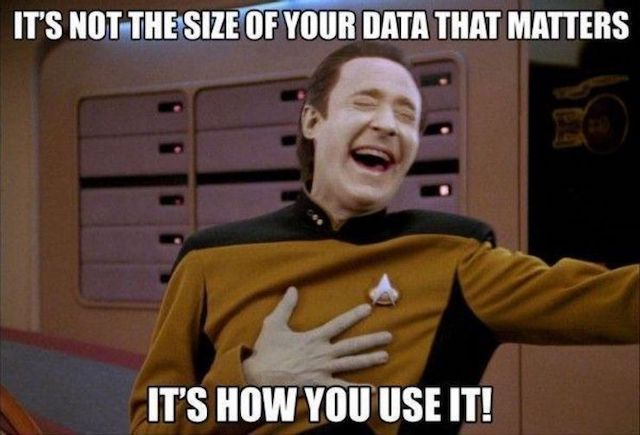

# Data, data, and more data

We ended last week with knowing **how** to import data, but there are things we didn't tell you... 



Let's revisit CSV files, since those are probably what you will use most. 

CSV files (and other file types!) can require extra effort to get them to appear how you want. 

Recall "bunchofnumbers.csv"? Once we made the dataframe, it didn't have a title, and wasn't labeled very well. It has an "Unnamed" header row we don't want... Eh, I don't like it. 

```
>>> results = pd.read_csv('practicefiles/bunchofnumbers.csv')
>>> print(results)
     Unnamed: 0  data
0             0     0
1             1     1
2             2     2
3             3     3
4             4     4
..          ...   ...
995         995   995
996         996   996
997         997   997
998         998   998
999         999   999

[1000 rows x 2 columns]
```

There are many parameters ([close to 50 for CSV files, alone!](https://pandas.pydata.org/docs/reference/api/pandas.read_csv.html)) we can use to remedy data issues we encounter.

 Let's remove the header: 
 
 ```
>>> results = pd.read_csv('practicefiles/bunchofnumbers.csv', header=None)
>>> print(results)
          0     1
0       NaN  data
1       0.0     0
2       1.0     1
3       2.0     2
4       3.0     3
...     ...   ...
996   995.0   995
997   996.0   996
998   997.0   997
999   998.0   998
1000  999.0   999

[1001 rows x 2 columns]
```

What happened? That may have been a dumb move, but everything is fixable! Let's name the columns what we actually want them to be:  

```
>>> results = pd.read_csv('practicefiles/bunchofnumbers.csv', names=['apples', 'bananas'])
>>> print(results.head(5))
   apples bananas
0     NaN    data
1     0.0       0
2     1.0       1
3     2.0       2
4     3.0       3
>>> 
```

Back to our "mistake"... When we named the header=None, it took the existing header and made it the data for the first row. Does anyone remember how to remove a row?

```
>>> results.drop(0).head(5)
   apples bananas
1     0.0       0
2     1.0       1
3     2.0       2
4     3.0       3
5     4.0       4
>>> 
```

Did we just create a view or a copy? Here's a hint:

```
>>> results2 = results.drop(0).head(5)
>>> results2
   apples bananas
1     0.0       0
2     1.0       1
3     2.0       2
4     3.0       3
5     4.0       4
>>> 
```

Really, what I should have done when creating the 'bunchofnumbers' dataframe was specified the column we wanted to use as an index with **index_col=0**. Live and learn!:

```
>>> results = pd.read_csv('practicefiles/bunchofnumbers.csv', index_col=0)
>>> print(results)
     data
0       0
1       1
2       2
3       3
4       4
..    ...
995   995
996   996
997   997
998   998
999   999

[1000 rows x 1 columns]
>>> 
```


If we were to convert "scary_pets_2" into a dataframe:

```
>>> results = pd.read_csv('practicefiles/scary_pets2.csv')
>>> print(results.head(5))
   id  location animal
0   0  1.098952   lion
1   1 -1.112979   lion
2   2  0.228454   lion
3   3  0.299128   lion
4   4  0.181097  tiger
```

But maybe we want it to be indexed by location:

```
>>> results = pd.read_csv('practicefiles/scary_pets2.csv', index_col='location')
>>> print(results.head(5))
           id animal
location            
 1.098952   0   lion
-1.112979   1   lion
 0.228454   2   lion
 0.299128   3   lion
 0.181097   4  tiger
>>> 
```
Open 'yucky.csv' and have a gander. 


Consider the outcome of turning "yucky" into a dataframe: 


```
>>> results = pd.read_csv('practicefiles/yucky.csv')
>>> print(results)
                                             I'm a jerk
may                                june july     august
0                                  0    0             0
1                                  1    14           13
2                                  2    22           32
3                                  3    5            67
I put this here                    NaN  NaN         NaN
4                                  4    65           34
5                                  5    61           12
6                                  6    45           32
7                                  7    90           11
To make your life difficult        NaN  NaN         NaN
8                                  8    34           23
9                                  9    23           33
What are you going to do about it? NaN  NaN         NaN
10                                 10   11           11
>>> 
```

What can we do to prevent that gunk from clogging up our works? I mean, we don't want NaN,  nor rows that provide no value, right? 

```
>>> results2 = pd.read_csv('practicefiles/yucky.csv', skiprows=[0, 6, 11, 14])
>>> print(results2)
    may  june  july  august
0     0     0     0       0
1     1     1    14      13
2     2     2    22      32
3     3     3     5      67
4     4     4    65      34
5     5     5    61      12
6     6     6    45      32
7     7     7    90      11
8     8     8    34      23
9     9     9    23      33
10   10    10    11      11
>>> 
```
So clean!

A good practice is to examine our data before converting it so we can prevent yucky stuff from ending up in our dataframe. There are ways to fix it once the dataframe was created, but there are a multitude of parameters to consider before even converting to a dataframe.

Other common parameters to consider are as follows:

**header**: Tells pandas if your file contains column names.

**sep**: Used when the delimiter of your file is something other than a comma. 

**usecols**: Tells pandas to read only a certain column or set of columns.

Practice with these to see how beneficial they can be. We will definitely be using them. 


## Inspecting a DataFrame Object

I snagged a larger CSV file from [SpatialKey](https://support.spatialkey.com/spatialkey-sample-csv-data/) that contains data from Sacramento area real estate transactions. 

I want to put this in a dataframe so I can gather information about the data:

```
>>> real = pd.read_csv('practicefiles/sacramento.csv')
```
And then once I have it in a dataframe, I can get properties of the dataframe and the data within it:

```
>>> real.empty
False
>>> real.shape
(985, 12)
```

My dataframe is definitely not empty and has 985 rows/observations with 12 columns/variables. What are the columns? 

```
>>> real.columns
Index(['street', 'city', 'zip', 'state', 'beds', 'baths', 'sq__ft', 'type',
       'sale_date', 'price', 'latitude', 'longitude'],
      dtype='object')
```
   
Great! Those are definitely data types I would expect to find in a real estate CSV. 

Let's get a closer look at the data: 

```
>>> real.head()
             street        city    zip state  beds  ...         type                     sale_date  price   latitude   longitude
0      3526 HIGH ST  SACRAMENTO  95838    CA     2  ...  Residential  Wed May 21 00:00:00 EDT 2008  59222  38.631913 -121.434879
1       51 OMAHA CT  SACRAMENTO  95823    CA     3  ...  Residential  Wed May 21 00:00:00 EDT 2008  68212  38.478902 -121.431028
2    2796 BRANCH ST  SACRAMENTO  95815    CA     2  ...  Residential  Wed May 21 00:00:00 EDT 2008  68880  38.618305 -121.443839
3  2805 JANETTE WAY  SACRAMENTO  95815    CA     2  ...  Residential  Wed May 21 00:00:00 EDT 2008  69307  38.616835 -121.439146
4   6001 MCMAHON DR  SACRAMENTO  95824    CA     2  ...  Residential  Wed May 21 00:00:00 EDT 2008  81900  38.519470 -121.435768

[5 rows x 12 columns]
```

And the last several rows:

```
>>> real.tail()
                  street             city    zip state  ...                     sale_date   price   latitude   longitude
980   9169 GARLINGTON CT       SACRAMENTO  95829    CA  ...  Thu May 15 00:00:00 EDT 2008  232425  38.457679 -121.359620
981      6932 RUSKUT WAY       SACRAMENTO  95823    CA  ...  Thu May 15 00:00:00 EDT 2008  234000  38.499893 -121.458890
982    7933 DAFFODIL WAY   CITRUS HEIGHTS  95610    CA  ...  Thu May 15 00:00:00 EDT 2008  235000  38.708824 -121.256803
983     8304 RED FOX WAY        ELK GROVE  95758    CA  ...  Thu May 15 00:00:00 EDT 2008  235301  38.417000 -121.397424
984  3882 YELLOWSTONE LN  EL DORADO HILLS  95762    CA  ...  Thu May 15 00:00:00 EDT 2008  235738  38.655245 -121.075915

[5 rows x 12 columns]
```

So far, so good. But let's get more info about the column data types with **.dtypes**. 

```
>>> real.dtypes
street        object
city          object
zip            int64
state         object
beds           int64
baths          int64
sq__ft         int64
type          object
sale_date     object
price          int64
latitude     float64
longitude    float64
dtype: object
```

And using **info()**, we are provided with a nice summarization of the dataframe:

```
>>> real.info()
<class 'pandas.core.frame.DataFrame'>
RangeIndex: 985 entries, 0 to 984
Data columns (total 12 columns):
 #   Column     Non-Null Count  Dtype  
---  ------     --------------  -----  
 0   street     985 non-null    object 
 1   city       985 non-null    object 
 2   zip        985 non-null    int64  
 3   state      985 non-null    object 
 4   beds       985 non-null    int64  
 5   baths      985 non-null    int64  
 6   sq__ft     985 non-null    int64  
 7   type       985 non-null    object 
 8   sale_date  985 non-null    object 
 9   price      985 non-null    int64  
 10  latitude   985 non-null    float64
 11  longitude  985 non-null    float64
dtypes: float64(2), int64(5), object(5)
memory usage: 92.5+ KB
```

The **.info()** method does a great job of providing us a way to see how many non-null entries in each column we have. In the above example we have none; all 985 values in all 12 columns are accounted for. 

Remember: Null values are missing values, and in pandas are represented by **None** for objects and **NaN** for non-numeric values in a float or integer column. 

So now we know a bit more about our real estate dataframe, we can begin to try to make sense of the data. 

## Describing Data / Summary Statistics

So far, we have a good idea about the properties of our dataframe, but we don't know much about our actual data and what it can tell us. Our next step is to get summary statistics with the **.describe()** method:

```
>>> real.describe()
                zip        beds       baths       sq__ft          price    latitude   longitude
count    985.000000  985.000000  985.000000   985.000000     985.000000  985.000000  985.000000
mean   95750.697462    2.911675    1.776650  1314.916751  234144.263959   38.607732 -121.355982
std       85.176072    1.307932    0.895371   853.048243  138365.839085    0.145433    0.138278
min    95603.000000    0.000000    0.000000     0.000000    1551.000000   38.241514 -121.551704
25%    95660.000000    2.000000    1.000000   952.000000  145000.000000   38.482717 -121.446127
50%    95762.000000    3.000000    2.000000  1304.000000  213750.000000   38.626582 -121.376220
75%    95828.000000    4.000000    2.000000  1718.000000  300000.000000   38.695589 -121.295778
max    95864.000000    8.000000    5.000000  5822.000000  884790.000000   39.020808 -120.597599
>>> 
```
Using **.describe()** returned a 5-number summary along with count, mean, and standard deviation for the seven columns with numeric data types (int64 or float64, in this case).   

Let's examine those values and their meanings:

**count**: This is the total number of data points in the column used to calculate other stats. 

**mean**: This is the average. All data point is added up and divided by the total number of data points. See [here](https://www.mathsisfun.com/mean.html#:~:text=How%20to%20Find%20the%20Mean,sum%20divided%20by%20the%20count.) for more on how to compute mean/averages.  

**std**: Standard deviation. It's a measure of how spread out numbers are. You can read about standard deviation [here](https://www.mathsisfun.com/data/standard-deviation.html). 

**5-number summary**: This is a statistics grouping that includes the minimum value, the 25% quartile, the median (50%, or middle value), the 75% quartile, and the maximum value. More about the 5-number summary can be found [here](https://www.thoughtco.com/what-is-the-five-number-summary-3126237).

(Note: You will have some of these computations as homework. It's important to know the meaning behind the numbers you deliver to a customer and be able to explain how you arrived at those values. This is a data analysis class--of course it involves math! It's nice that we have pandas to do the math for us, but you still need to understand the concepts.)

What did we learn from **.describe()**? Well, in this dataset, per the sale dates included (we cannot infer conclusions about data we don't have, right?), in Sacramento, the average house bought/sold has 2.9 beds, 1.8 baths, 1315 square feet, and the average price is around $234,000. 

We also learned the average zip code, which provides absolutely no value. 

**HUGE CAVEAT**: The **describe()** method performs summary statistics for non-null values. This particular dataset has 985 rows. If 50 rows had no bathroom data, then the average would be calculated as the sum of the non-null rows divided by 935. Often we might need to change null values to 0 before doing calculations to ensure data for that row/observation is included. 

**.describe()** comes with fancy parameters as well. We can choose which percentiles to return if we want a non-standard 5-number summary:

```
>>> real.describe(percentiles=[0.10, 0.85])
                zip        beds       baths       sq__ft          price    latitude   longitude
count    985.000000  985.000000  985.000000   985.000000     985.000000  985.000000  985.000000
mean   95750.697462    2.911675    1.776650  1314.916751  234144.263959   38.607732 -121.355982
std       85.176072    1.307932    0.895371   853.048243  138365.839085    0.145433    0.138278
min    95603.000000    0.000000    0.000000     0.000000    1551.000000   38.241514 -121.551704
10%    95626.000000    0.000000    0.000000     0.000000   90000.000000   38.423251 -121.491452
50%    95762.000000    3.000000    2.000000  1304.000000  213750.000000   38.626582 -121.376220
85%    95834.000000    4.000000    3.000000  2060.800000  361826.200000   38.737620 -121.265536
max    95864.000000    8.000000    5.000000  5822.000000  884790.000000   39.020808 -120.597599
>>> 
```
A cool trick to return only the value at a specific quantile:

```
>>> real.quantile(0.10)
zip          95626.000000
beds             0.000000
baths            0.000000
sq__ft           0.000000
price        90000.000000
latitude        38.423251
longitude     -121.491452
Name: 0.1, dtype: float64
>>> 
```

It is the same data as in the describe() results, but without any of the unrelated statistics. 

When we use describe on *all* columns, we get descriptions on non-numeric data (columns with datatype = object) that include count, unique, top, and freq:

```
>>> real.describe(include='all')
                   street        city           zip state  ...                     sale_date          price    latitude   longitude
count                 985         985    985.000000   985  ...                           985     985.000000  985.000000  985.000000
unique                981          39           NaN     1  ...                             5            NaN         NaN         NaN
top     7 CRYSTALWOOD CIR  SACRAMENTO           NaN    CA  ...  Mon May 19 00:00:00 EDT 2008            NaN         NaN         NaN
freq                    2         439           NaN   985  ...                           268            NaN         NaN         NaN
mean                  NaN         NaN  95750.697462   NaN  ...                           NaN  234144.263959   38.607732 -121.355982
std                   NaN         NaN     85.176072   NaN  ...                           NaN  138365.839085    0.145433    0.138278
min                   NaN         NaN  95603.000000   NaN  ...                           NaN    1551.000000   38.241514 -121.551704
25%                   NaN         NaN  95660.000000   NaN  ...                           NaN  145000.000000   38.482717 -121.446127
50%                   NaN         NaN  95762.000000   NaN  ...                           NaN  213750.000000   38.626582 -121.376220
75%                   NaN         NaN  95828.000000   NaN  ...                           NaN  300000.000000   38.695589 -121.295778
max                   NaN         NaN  95864.000000   NaN  ...                           NaN  884790.000000   39.020808 -120.597599

[11 rows x 12 columns]
```

It might be more convenient and more easily readable to specify the method for ONLY object columns, especially if it is a large dataframe:

```
>>> real.describe(include=np.object)
                   street        city state         type                     sale_date
count                 985         985   985          985                           985
unique                981          39     1            4                             5
top     7 CRYSTALWOOD CIR  SACRAMENTO    CA  Residential  Mon May 19 00:00:00 EDT 2008
freq                    2         439   985          917                           268
>>> 
```

**count** ....is the total on non-null occurrences. We learned that above. 

**unique** tells us how many unique values were in the column.

**top** tells us the **mode**, which is the [most frequent value observed](https://www.mathsisfun.com/mode.html). 

**freq** tells us the number of times the mode was observed. 


Guess what? The **describe()** method also works on Series. This is helpful if we are only interested in a particular column. 

```
>>> real['beds'].describe()
count    985.000000
mean       2.911675
std        1.307932
min        0.000000
25%        2.000000
50%        3.000000
75%        4.000000
max        8.000000
Name: beds, dtype: float64
>>>
```

If we wanted to examine sales price:

```
>>> real['price'].describe()
count       985.000000
mean     234144.263959
std      138365.839085
min        1551.000000
25%      145000.000000
50%      213750.000000
75%      300000.000000
max      884790.000000
Name: price, dtype: float64
>>> 
```
Or with dot notation:

```
>>> real.price.describe()
count       985.000000
mean     234144.263959
std      138365.839085
min        1551.000000
25%      145000.000000
50%      213750.000000
75%      300000.000000
max      884790.000000
Name: price, dtype: float64
```

Or we can single out one statistic on one column. Let's look for the maximum price without using describe:

```
>>> real['price'].max()
884790
>>>
```
And if we wanted to find the index of where the max value occurs:

```
>>> real['price'].idxmax()
864
>>> 
```

More documentation on **describe()** and applicable methods can be found [here](https://pandas.pydata.org/docs/reference/api/pandas.DataFrame.describe.html). There is also a great [user guide](https://pandas.pydata.org/docs/user_guide/basics.html?highlight=summary%20statistics#summarizing-data-describe) with plenty of examples. 

What's the address for the item at index of 864? I want to do a drive-by so I can see an expensive house in Sacramento! (I'm not a stalker. I swear!).

```
>>> real['street'][864]
'9401 BARREL RACER CT'
>>> 
```

Finally, this stuff is getting useful! [A virtual drive-by.... Check out that price history](https://www.trulia.com/p/ca/wilton/9401-barrel-racer-ct-wilton-ca-95693--2085679438). What other kinds of queries can we do?

**Sum** is pretty fun, but you'd best apply it to a Series:

```
>>> real.sum()
street       3526 HIGH ST51 OMAHA CT2796 BRANCH ST2805 JANE...
city         SACRAMENTOSACRAMENTOSACRAMENTOSACRAMENTOSACRAM...
zip                                                   94314437
state        CACACACACACACACACACACACACACACACACACACACACACACA...
beds                                                      2868
baths                                                     1750
sq__ft                                                 1295193
type         ResidentialResidentialResidentialResidentialRe...
sale_date    Wed May 21 00:00:00 EDT 2008Wed May 21 00:00:0...
price                                                230632100
latitude                                          38028.616105
longitude                                       -119535.642502
dtype: object
>>> 
```
That's a lot of toilets!

```
>>> real['baths'].sum()
1750
>>> 
```
Cumulative summary, or **cumsum()**, calculates a running total (we have 28 bathrooms in the first 20 properties on our list!):

```
>>> real['baths'].cumsum().head(20)
0      1
1      2
2      3
3      4
4      5
5      6
6      8
7      9
8     11
9     13
10    15
11    17
12    18
13    19
14    21
15    23
16    24
17    25
18    26
19    28
Name: baths, dtype: int64
>>> 
```
**unique()** gives us a list of the values of the columns. Properties in our list have up to 5 bathrooms:

```
>>> real['baths'].unique()
array([1, 2, 3, 4, 0, 5])
>>> 
```
We can get the frequency of how many times each unique value shows up in our dataframe with **value_counts()**:

```
>>> real['baths'].value_counts()
2    544
1    180
3    132
0    108
4     19
5      2
Name: baths, dtype: int64
>>> 
```

108 properties with 0 baths! Must have been vacant lots...

And with **mode()** we see the most common value for the 'baths' column was 2:

```
>>> real['baths'].mode()
0    2
dtype: int64
>>> 
```

We can specify the columns we want by passing in a list:

```
>>> real[['baths', 'street']]
     baths               street
0        1         3526 HIGH ST
1        1          51 OMAHA CT
2        1       2796 BRANCH ST
3        1     2805 JANETTE WAY
4        1      6001 MCMAHON DR
..     ...                  ...
980      3   9169 GARLINGTON CT
981      2      6932 RUSKUT WAY
982      2    7933 DAFFODIL WAY
983      2     8304 RED FOX WAY
984      2  3882 YELLOWSTONE LN

[985 rows x 2 columns]
>>> 
```
Python's string methods (in this case, a list comprehension) are helpful when we don't want to pick out all the columns by hand. In this case, beds and baths both start with 'b', so they are included, and all columns appear in the order requested:

```
>>> real[['price', 'street'] + [col for col in real.columns if col.startswith('b')]]
      price               street  beds  baths
0     59222         3526 HIGH ST     2      1
1     68212          51 OMAHA CT     3      1
2     68880       2796 BRANCH ST     2      1
3     69307     2805 JANETTE WAY     2      1
4     81900      6001 MCMAHON DR     2      1
..      ...                  ...   ...    ...
980  232425   9169 GARLINGTON CT     4      3
981  234000      6932 RUSKUT WAY     3      2
982  235000    7933 DAFFODIL WAY     3      2
983  235301     8304 RED FOX WAY     4      2
984  235738  3882 YELLOWSTONE LN     3      2

[985 rows x 4 columns]
>>> 
```

Basic Python can come back to haunt you when you least expect it!

How do you think you pull certain rows to examine? With slicing! Remember the first number is inclusive and the second one is exclusive. So, **df[include:exclude]**. 

```
>>> real[15:20]
                     street            city    zip state  beds  baths  sq__ft         type                     sale_date   price   latitude   longitude
15           7340 HAMDEN PL      SACRAMENTO  95842    CA     2      2    1134        Condo  Wed May 21 00:00:00 EDT 2008  110700  38.700051 -121.351278
16              6715 6TH ST       RIO LINDA  95673    CA     2      1     844  Residential  Wed May 21 00:00:00 EDT 2008  113263  38.689591 -121.452239
17  6236 LONGFORD DR Unit 1  CITRUS HEIGHTS  95621    CA     2      1     795        Condo  Wed May 21 00:00:00 EDT 2008  116250  38.679776 -121.314089
18          250 PERALTA AVE      SACRAMENTO  95833    CA     2      1     588  Residential  Wed May 21 00:00:00 EDT 2008  120000  38.612099 -121.469095
19          113 LEEWILL AVE       RIO LINDA  95673    CA     3      2    1356  Residential  Wed May 21 00:00:00 EDT 2008  121630  38.689999 -121.463220
>>> 
```
We can narrow down our results to return certain columns for certain rows:

```
>>> real[['street', 'price']][15:20]
                     street   price
15           7340 HAMDEN PL  110700
16              6715 6TH ST  113263
17  6236 LONGFORD DR Unit 1  116250
18          250 PERALTA AVE  120000
19          113 LEEWILL AVE  121630
>>> 
```
Using **.loc()**:

```
>>> real.loc[15:20, 'baths']
15    2
16    1
17    1
18    1
19    2
20    2
Name: baths, dtype: int64
>>> real.loc[15:20, ['baths', 'street']]
    baths                   street
15      2           7340 HAMDEN PL
16      1              6715 6TH ST
17      1  6236 LONGFORD DR Unit 1
18      1          250 PERALTA AVE
19      2          113 LEEWILL AVE
20      2       6118 STONEHAND AVE
>>>
```

And using **.iloc()**, providing a list of integers for column values:

```
>>> real.iloc[15:20, [2, 3]]
      zip state
15  95842    CA
16  95673    CA
17  95621    CA
18  95833    CA
19  95673    CA
>>> 
```
Remember that with .loc, slicing is inclusive of the last index, and with .iloc it is exclusive (just like with Python).

Spot the difference here also when we use slicing syntax for column values:

 ```
 >>> real.iloc[15:20, 2:3]
      zip
15  95842
16  95673
17  95621
18  95833
19  95673
>>> 
 ```
And as we have seen a bit of before, **at()** and **iat()** are quick ways to retrieve distinct values:

```
# with .at()
>>> real.at[5, 'street']
'5828 PEPPERMILL CT'
# or with .iat()
>>> real.iat[5, 0]
'5828 PEPPERMILL CT'
>>> 
```

The big question on my mind is which address(es) has 5 bathrooms.

```
>>> real[real.baths > 4]
           street             city    zip state  beds  baths  sq__ft         type                     sale_date   price   latitude   longitude
157  315 JUMEL CT  EL DORADO HILLS  95762    CA     6      5       0  Residential  Wed May 21 00:00:00 EDT 2008  830000  38.669931 -121.059580
332  4128 HILL ST        FAIR OAKS  95628    CA     5      5    2846  Residential  Tue May 20 00:00:00 EDT 2008  680000  38.641670 -121.262099
>>> 
```

I wonder if either of those have [these 5 beautiful bathrooms](https://www.theinertia.com/gallery/5-bathrooms-that-will-make-you-feel-like-youre-aqua-dumping/). 

