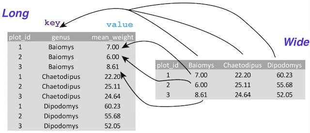

# Data Wrangling


**Data Wrangling**: taking data from its original state and changing it, or manipulating it, so it is in a usable format and ready for analysis. 

We've learned a lot over the last couple of weeks -- Topics which fall under the umbrella of data selection and inspection: How to work with NumPy, Pandas (Series and DataFrames), how to filter/slice/and select data in those objects, how to bring in data from outside sources and describe it with basic summary statistics...

Recall the first night of class, when we introduced the steps of Data Analysis. We're now ready to learn the ins and outs of Data Wrangling (Go back to [Week 1, Class 1](../Week1/Class1.md#data-wrangling) to get a review). We will often get data that is not ready for analysis, so it is up to us to sift through it, get to know it intimately, and make decisions on how to treat the data prior to performing any analysis. 

Data wrangling isn't something we'll do once with each data set (well, maybe....), but often we'll do some wrangling, do an analysis task, put it into a visualization, and then decide to go back and do more data wrangling. Data wrangling involves Data cleaning, data transformation, and data enrichment, and is not performed in any particular order. 

Remember: It's up to you to determine the types of data you need for your analysis and visualization. You're trying to tell a story and sell a story, so evidence is crucial to answering the question at hand. 

## Data Cleaning


Data cleaning is often the best starting point as it will position us with a data set having the correct data types and memorable, easy column names (for example). We will be overjoyed to have the bare minimum format needed to properly explore our data! Tasks we could do in this step could involve converting data types, renaming things, removing duplicates, solving missing data issues, reordering, sorting, and filtering. We'll be detecting and/or removing corrupt or inaccurate records. 

## Data Transformation


Data transformation is the restructuring of data to make our analysis easier. Often we'll need to swap rows vs. columns, and depending on our needs we will need a long or wide format.

So far, we've only worked with wide format. Wide format is most preferred for both database design and data analysis (And Tableau, as you will discover later), as each column will have a singular data type and instance corresponding to one observation. Wide format makes it easier to do summary statistics and plots. 

Long format has a row for each observation of a variable. See if you can spot the difference in the below example: 



Here is one way our Sacramento real estate dataframe could appear as long form:


  ```
                  city   variable             value
0           SACRAMENTO     street      3526 HIGH ST
1           SACRAMENTO     street       51 OMAHA CT
2           SACRAMENTO     street    2796 BRANCH ST
3           SACRAMENTO     street  2805 JANETTE WAY
4           SACRAMENTO     street   6001 MCMAHON DR
...                ...        ...               ...
10830       SACRAMENTO  longitude        -121.35962
10831       SACRAMENTO  longitude        -121.45889
10832   CITRUS HEIGHTS  longitude       -121.256803
10833        ELK GROVE  longitude       -121.397424
10834  EL DORADO HILLS  longitude       -121.075915

[10835 rows x 3 columns]
>>> real.describe()
              city variable  value
count        10835    10835  10835
unique          39       11   4210
top     SACRAMENTO     type     CA
freq          4829      985    985
```
Each variable per city creates a new row. As you can see, summary statistics might either not be useful or require additional manipulation. Additionally, plotting in Pandas requires wide form, but other programs such as Seaborn can handle (very well!) plotting from long format. 

**Discussion**: When do you think "long" format might be useful? 

## Data Enrichment


Data Enrichment is enhancing, refining, and improving the quality of raw data by adding to it, in one way or another. 

We can merge new data with existing data, add new columns (perhaps by using calculations on existing data), aggregate (summarize), resample (summarize time series data at specific intervals), and bin (putting data in buckets for further analysis).

 
#### Missing Data - How do we handle it?

We will be exploring various ways of handling missing data. There are plenty of methods for you to use depending on your data set. Each data set will be unique and have its own challenges, but we will provide you with several examples. 

Recall that summary statistics excludes missing data in calculations. Pandas represents missing data with "NaN" (Not a Number), which is referred to in the field as a "**sentinel**" value that is easily detected in queries. But how do we go about detecting missing data in our data set?

```
>>> cities = pd.Series(['NYC', 'STL', np.nan, 'CHI', 'SFO'])
>>> cities
0    NYC
1    STL
2    NaN
3    CHI
4    SFO
dtype: object
>>> cities.isnull()
0    False
1    False
2     True
3    False
4    False
dtype: bool
>>> 
```
You can accomplish the same this with **.isna()**. In pandas, we refer to missing data as "**NA**" (not available), which may imply the data does not exist or was not observed. Cleaning up data involves doing analysis on the missing data in order to identify collection problems or biases caused by missing data. 

Python uses the "**None**" value, and is also treated as NA in object arrays: 

```
>>> cities.isnull()
0    False
1    False
2     True
3    False
4    False
dtype: bool
>>> cities[4] = None
>>> cities
0     NYC
1     STL
2     NaN
3     CHI
4    None
dtype: object
>>> cities.isnull()
0    False
1    False
2     True
3    False
4     True
dtype: bool
>>> 
```

We know from previous lessons (and from above) the **isnull()** method returns boolean values indicative of missing or NA values. The method **notnull()** does the opposite, as you may have guessed:

```
>>> cities.notnull()
0     True
1     True
2    False
3     True
4    False
dtype: bool
>>> 
```
How many entries in our Cities series are null?

```
>>> cities.isnull().sum()
2
>>> 
```
How about in our Sacramento real estate dataframe?

```
>>> real.isnull().sum()
street       0
city         0
zip          0
state        0
beds         0
baths        0
sq__ft       0
type         0
sale_date    0
price        0
latitude     0
longitude    0
dtype: int64
>>> 
```
Well, that one looks too easy to work with if we're aiming to learn about missing data. Let's start working with a different set of data. Sorry... It's about real estate again. 

```
>>> properties = pd.read_csv('PracticeFiles/properties.csv')
>>> properties
           PID  ST_NUM     ST_NAME OWN_OCCUPIED NUM_BEDROOMS NUM_BATH SQ_FT
0  100001000.0   104.0      PUTNAM            Y            3        1  1000
1  100002000.0   197.0   LEXINGTON            N            3      1.5    --
2  100003000.0     NaN   LEXINGTON            N          NaN        1   850
3  100004000.0   201.0    BERKELEY           12            1      NaN   700
4          NaN   203.0    BERKELEY            Y            3        2  1600
5  100006000.0   207.0    BERKELEY            Y          NaN        1   800
6  100007000.0     NaN  WASHINGTON          NaN            2   HURLEY   950
7  100008000.0   213.0     TREMONT            Y            1        1   NaN
8  100009000.0   215.0     TREMONT            Y           na        2  1800
```
From those column names, can we infer the data each column is supposed to hold? "OWN\_OCCUPIED" means owner-occupied, and "SQ\_FT" is square footage. 

Once we have an understanding of the column titles, start examining new data sets by looking at expected data types. Once we know what the expected type is, we can start to weed out the "unexpected"... You'll see what I mean shortly. 

```
>>> properties.dtypes
PID             float64
ST_NUM          float64
ST_NAME          object
OWN_OCCUPIED     object
NUM_BEDROOMS     object
NUM_BATH         object
SQ_FT            object
dtype: object
```

The first two columns, PID AND ST\_NUM, are obviously numeric (floats), and the others look to be strings or other numeric types. OWN\_OCCUPIED expects a Y or an N as a string. 

By looking at our initial data on our bedroom column, how many null values are you expecting? 

```
>>> properties['NUM_BEDROOMS']
0      3
1      3
2    NaN
3      1
4      3
5    NaN
6      2
7      1
8     na
Name: NUM_BEDROOMS, dtype: object
```

I see three! Let's use **isnull()** on our bedroom column. 

```
>>> properties['NUM_BEDROOMS'].isnull()
0    False
1    False
2     True
3    False
4    False
5     True
6    False
7    False
8    False
Name: NUM_BEDROOMS, dtype: bool
>>> 
>>> properties['NUM_BEDROOMS'].isnull().sum()
2
>>> 
```

There are only two null values? What happened. Oh, pandas doesn't read "na" as a null value. UGH. What are other possible null values you see in our data?

What about the "--" in SQ\_FT?

```
>>> properties['SQ_FT']
0    1000
1      --
2     850
3     700
4    1600
5     800
6     950
7     NaN
8    1800
Name: SQ_FT, dtype: object
>>> properties['SQ_FT'].isnull()
0    False
1    False
2    False
3    False
4    False
5    False
6    False
7     True
8    False
Name: SQ_FT, dtype: bool
>>> properties['SQ_FT'].isnull().sum()
1
>>> 
```

Yeah, it doesn't like it and it does not get read as 'NaN'. That's unfortunate. 

How does this happen? How do these values get in there? Well, it's possible human error. Or there wasn't an established way to enter null values at the time of data collection. Or the data was imported from elsewhere where data reporting standards were not applicable. It could be from several scenarios, but it is our duty to find the inconsistencies and "fix" them. So... how do we turn our "na" and "--" to NaN so Pandas will know those values are null?

We can define them and re-read our csv. For overkill, I'll add "n/a"...

Question: Do we need to add "None"? No, because pandas treats it as NaN. 

```
>>> missing_datapoints = ['na', '--', 'n/a', 'NA']
>>> properties = pd.read_csv('PracticeFiles/properties.csv', na_values=missing_datapoints)
>>> properties
           PID  ST_NUM     ST_NAME OWN_OCCUPIED  NUM_BEDROOMS NUM_BATH   SQ_FT
0  100001000.0   104.0      PUTNAM            Y           3.0        1  1000.0
1  100002000.0   197.0   LEXINGTON            N           3.0      1.5     NaN
2  100003000.0     NaN   LEXINGTON            N           NaN        1   850.0
3  100004000.0   201.0    BERKELEY           12           1.0      NaN   700.0
4          NaN   203.0    BERKELEY            Y           3.0        2  1600.0
5  100006000.0   207.0    BERKELEY            Y           NaN        1   800.0
6  100007000.0     NaN  WASHINGTON          NaN           2.0   HURLEY   950.0
7  100008000.0   213.0     TREMONT            Y           1.0        1     NaN
8  100009000.0   215.0     TREMONT            Y           NaN        2  1800.0
>>> 
```
Yay! We now have replaced those values with NaN. 

With a larger dataset, you'll find more NaN types later in your analysis and you can always add them to the **na_values** as you go. 

You can always define a customized "missing" sentinel. This changes NaN values to a value of your choosing:

```
>>> properties.fillna("missing")
           PID   ST_NUM     ST_NAME OWN_OCCUPIED NUM_BEDROOMS NUM_BATH    SQ_FT
0  100001000.0    104.0      PUTNAM            Y          3.0        1   1000.0
1  100002000.0    197.0   LEXINGTON            N          3.0      1.5  missing
2  100003000.0  missing   LEXINGTON            N      missing        1    850.0
3  100004000.0    201.0    BERKELEY           12          1.0  missing    700.0
4      missing    203.0    BERKELEY            Y          3.0        2   1600.0
5  100006000.0    207.0    BERKELEY            Y      missing        1    800.0
6  100007000.0  missing  WASHINGTON      missing          2.0   HURLEY    950.0
7  100008000.0    213.0     TREMONT            Y          1.0        1  missing
8  100009000.0    215.0     TREMONT            Y      missing        2   1800.0
>>> 
```
You can use a different value with fillna() with a dict:

```
>>> properties.fillna({'NUM_BEDROOMS': 0, 'SQ_FT': 0})
           PID  ST_NUM     ST_NAME OWN_OCCUPIED  NUM_BEDROOMS NUM_BATH   SQ_FT
0  100001000.0   104.0      PUTNAM            Y           3.0        1  1000.0
1  100002000.0   197.0   LEXINGTON            N           3.0      1.5     0.0
2  100003000.0     NaN   LEXINGTON            N           0.0        1   850.0
3  100004000.0   201.0    BERKELEY           12           1.0      NaN   700.0
4          NaN   203.0    BERKELEY            Y           3.0        2  1600.0
5  100006000.0   207.0    BERKELEY            Y           0.0        1   800.0
6  100007000.0     NaN  WASHINGTON          NaN           2.0   HURLEY   950.0
7  100008000.0   213.0     TREMONT            Y           1.0        1     0.0
8  100009000.0   215.0     TREMONT            Y           0.0        2  1800.0
>>> 
```

We can drop all rows that have missing data:

```
>>> properties.dropna()
           PID  ST_NUM ST_NAME OWN_OCCUPIED  NUM_BEDROOMS NUM_BATH   SQ_FT
0  100001000.0   104.0  PUTNAM            Y           3.0        1  1000.0
>>> 
```
Yikes! That would leave us with one row. If we did it column-wise, the only column without missing values is ST\_NAME:

```
>>> properties.dropna(axis=1)
      ST_NAME
0      PUTNAM
1   LEXINGTON
2   LEXINGTON
3    BERKELEY
4    BERKELEY
5    BERKELEY
6  WASHINGTON
7     TREMONT
8     TREMONT
>>> 
```
The method **dropna()** works a little bit differently with Series:

```
>>> datuh = pd.Series([1, 2, np.nan, 4, 5, np.nan])
>>> datuh
0    1.0
1    2.0
2    NaN
3    4.0
4    5.0
5    NaN
dtype: float64
>>> datuh.dropna()
0    1.0
1    2.0
3    4.0
4    5.0
dtype: float64
>>> 
```
But back to our properties dataframe... dropna() by default drops any row containing a missing value. 

properties.dropna(how="all") would only drop rows that are all NA. 

properties.dropna(axis=1, how="all") would work on columns that have all NA values. 

Sometimes when we are filling in values it might be a good idea to pass in the mean or median values of a Series:

```
>>> sqft = pd.Series(properties['SQ_FT'])
>>> sqft
0    1000.0
1       NaN
2     850.0
3     700.0
4    1600.0
5     800.0
6     950.0
7       NaN
8    1800.0
Name: SQ_FT, dtype: float64
>>> sqft_fill = sqft.fillna(sqft.mean())
>>> sqft_fill
0    1000.0
1    1100.0
2     850.0
3     700.0
4    1600.0
5     800.0
6     950.0
7    1100.0
8    1800.0
Name: SQ_FT, dtype: float64
>>> properties['SQ_FT'] = sqft_fill
>>> properties
           PID  ST_NUM     ST_NAME OWN_OCCUPIED  NUM_BEDROOMS NUM_BATH   SQ_FT
0  100001000.0   104.0      PUTNAM            Y           3.0        1  1000.0
1  100002000.0   197.0   LEXINGTON            N           3.0      1.5  1100.0
2  100003000.0     NaN   LEXINGTON            N           NaN        1   850.0
3  100004000.0   201.0    BERKELEY           12           1.0      NaN   700.0
4          NaN   203.0    BERKELEY            Y           3.0        2  1600.0
5  100006000.0   207.0    BERKELEY            Y           NaN        1   800.0
6  100007000.0     NaN  WASHINGTON          NaN           2.0   HURLEY   950.0
7  100008000.0   213.0     TREMONT            Y           1.0        1  1100.0
8  100009000.0   215.0     TREMONT            Y           NaN        2  1800.0
>>> 
```

What if the sentinel for missing values isn't something pandas recognizes as NaN? In this case, -9999?

```
>>> df = pd.Series([1, 5, -9999, 5, -9999, 2])
>>> df
0       1
1       5
2   -9999
3       5
4   -9999
5       2
dtype: int64
>>> df.replace(-9999, np.nan)
0    1.0
1    5.0
2    NaN
3    5.0
4    NaN
5    2.0
dtype: float64
```

Using **replace()** will create a new Series. Passing inplace=True changes the original Series:

```
>>> df.replace(-9999, np.nan, inplace=True)
>>> df
0    1.0
1    5.0
2    NaN
3    5.0
4    NaN
5    2.0
```

Examining the OWN\_OCCUPIED column presents a different kind of missing data challenge. Can anyone spot it? What about in NUM\_BATH?

```
>>> properties['OWN_OCCUPIED']
0      Y
1      N
2      N
3     12
4      Y
5      Y
6    NaN
7      Y
8      Y
Name: OWN_OCCUPIED, dtype: object
>>> 
>>> properties['OWN_OCCUPIED'].isnull()
0    False
1    False
2    False
3    False
4    False
5    False
6     True
7    False
8    False
Name: OWN_OCCUPIED, dtype: bool
>>> 
```

At [3], we have a numeric value where we are expecting a string (Y/N) indicating a boolean value--probably a typo (No judgments!). Our goal is to fill this numeric data point with NaN since we have no way of knowing its true value. 


Now, we know it's just one value for this dataframe, but what if it was a larger dataset? Can you come up with a program to loop through the values and replace data that does not meet our criteria with NaN? 

It took me a minute, but I came up with this as a solution:

```
>>> cnt=0
>>> for row in properties['OWN_OCCUPIED']:
...     if row != 'Y' and row != 'N':
...             properties.loc[cnt, 'OWN_OCCUPIED'] = np.nan
...     cnt+=1
... 
>>> properties
           PID  ST_NUM     ST_NAME OWN_OCCUPIED  NUM_BEDROOMS NUM_BATH   SQ_FT
0  100001000.0   104.0      PUTNAM            Y           3.0        1  1000.0
1  100002000.0   197.0   LEXINGTON            N           3.0      1.5     NaN
2  100003000.0     NaN   LEXINGTON            N           NaN        1   850.0
3  100004000.0   201.0    BERKELEY          NaN           1.0      NaN   700.0
4          NaN   203.0    BERKELEY            Y           3.0        2  1600.0
5  100006000.0   207.0    BERKELEY            Y           NaN        1   800.0
6  100007000.0     NaN  WASHINGTON          NaN           2.0   HURLEY   950.0
7  100008000.0   213.0     TREMONT            Y           1.0        1     NaN
8  100009000.0   215.0     TREMONT            Y           NaN        2  1800.0
>>> 
```

Discuss other types of data mistakes you might find in the OWN\_OCCUPIED columns as well as other ways to iterate over the rows to accomplish replacing the values. 

What about a vectorized method? 

Isolate the Series:

```
>>> oo = properties['OWN_OCCUPIED']
>>> oo
0      Y
1      N
2      N
3     12
4      Y
5      Y
6    NaN
7      Y
8      Y
Name: OWN_OCCUPIED, dtype: object
```
Convert to a numeric type with [**to_numeric()**](https://pandas.pydata.org/pandas-docs/stable/reference/api/pandas.to_numeric.html). We pass in errors="coerce" to indicate invalid parsing to be set as NaN:

```
>>> oon = pd.to_numeric(oo, errors="coerce")
>>> oon
0     NaN
1     NaN
2     NaN
3    12.0
4     NaN
5     NaN
6     NaN
7     NaN
8     NaN
Name: OWN_OCCUPIED, dtype: float64
```

We then create a boolean mask to identify the numeric value we want to change to NaN:

```
>>> mask = oon.notna()
>>> mask
0    False
1    False
2    False
3     True
4    False
5    False
6    False
7    False
8    False
Name: OWN_OCCUPIED, dtype: bool
```

Change the value with loc:

```
>>> oo.loc[mask] = np.nan
>>> oo
0      Y
1      N
2      N
3    NaN
4      Y
5      Y
6    NaN
7      Y
8      Y
Name: OWN_OCCUPIED, dtype: object
>>> 
```

Sometimes rows will have accidental duplicate rows. For instance:

```
# you can get really creative with how you construct Series and DataFrames
>>> datuhhh = pd.DataFrame({'blob': ['tree', 'flower'] * 2 + ['flower'], 'glob': [1, 2, 3, 4, 4]})
>>> datuhhh
     blob  glob
0    tree     1
1  flower     2
2    tree     3
3  flower     4
4  flower     4
>>> 
```
The rows at datuhhh.loc[3] and datuhhh.loc[4] are obviously duplicates, but we can verify with larger data sets like this with **duplicated()**, which provides a boolean value for each row.

```
>>> datuhhh.duplicated()
0    False
1    False
2    False
3    False
4     True
dtype: bool
>>> datuhhh.duplicated().sum()
1
>>> 
```
Then, of course, if we have a duplicate row and a further investigation warrants dropping it, we can do that with **drop_duplicates()**!

```
>>> datuhhh.drop_duplicates()
     blob  glob
0    tree     1
1  flower     2
2    tree     3
3  flower     4
>>>
```
Adding another columns to demonstrate a couple of things..

```
>>> datuhhh['glob2'] = range(5)
>>> datuhhh
     blob  glob  glob2
0    tree     1      0
1  flower     2      1
2    tree     3      2
3  flower     4      3
4  flower     4      4
```

You can specify any subset you'd like to remove duplicates. Here, if we select 'blob' we get two rows back, one each for tree and flower. And, by default, pandas chooses the first instance of each row. 

```
>>> datuhhh.drop_duplicates(['blob'])
     blob  glob  glob2
0    tree     1      0
1  flower     2      1
>>>
```

Passing 'last' tells pandas to keep the last instance row instead of the first one:

```
>>> datuhhh
     blob  glob  glob2
0    tree     1      0
1  flower     2      1
2    tree     3      2
3  flower     4      3
4  flower     4      4
>>> datuhhh.drop_duplicates(['blob'], keep='last')
     blob  glob  glob2
2    tree     3      2
4  flower     4      4
>>> 
```

The same concept, but with **duplicated()** and our original datuhhh:

```
>>> datuhhh
     blob  glob
0    tree     1
1  flower     2
2    tree     3
3  flower     4
4  flower     4
>>> datuhhh.duplicated()
0    False
1    False
2    False
3    False
4     True
dtype: bool
>>> datuhhh.duplicated(keep='last')
0    False
1    False
2    False
3     True
4    False
dtype: bool
>>> 
```
Let's take a pause to go over some fun string manipulation methods! We're going to need these skills on occasion to neaten our data content.

I have a friend in the city with backyard chickens named as such:

```
>>> chickens = pd.Series(['Patty', 'Tikka', 'Nugget', 'Parmesan', pd.NA, 'Noodle', 'Dumpling II'], dtype='string')
```
(But not NA, of course!)


Applying **str** to a Series returns a StringMethods object, and opens up access to other string processing methods. 

```
>>> chickens.str
<pandas.core.strings.accessor.StringMethods object at 0x113693f70>
```

These methods are pretty simple; the challenge is in knowing they exist and knowing which one to use in each case. 

To uppercase and to lowercase: 

```
>>> chickens.str.upper()
0          PATTY
1          TIKKA
2         NUGGET
3       PARMESAN
4           <NA>
5         NOODLE
6    DUMPLING II
dtype: string
>>> chickens.str.lower()
0          patty
1          tikka
2         nugget
3       parmesan
4           <NA>
5         noodle
6    dumpling ii
dtype: string
```

Length (number of characters) of each string value: 

```
>>> chickens.str.len()
0       5
1       5
2       6
3       8
4    <NA>
5       6
6      11
dtype: Int64
```

We can specify a delimiter to split each string and put the substrings in a list. Pay attention to "Dumpling II":

```
>>> chickens.str.split(' ')
0           [Patty]
1           [Tikka]
2          [Nugget]
3        [Parmesan]
4              <NA>
5          [Noodle]
6    [Dumpling, II]
dtype: object
```
Using **get()** returns items from the subset. Again, pay attention to Dumpling II.

```
>>> chickens.str.split(' ').str.get(0)
0       Patty
1       Tikka
2      Nugget
3    Parmesan
4        <NA>
5      Noodle
6    Dumpling
dtype: object
```

We can replace values in our strings. Here we replaced the space in Dumpling II with "---":

```
>>> chickens.str.replace(pat=' ', repl='---')
0            Patty
1            Tikka
2           Nugget
3         Parmesan
4             <NA>
5           Noodle
6    Dumpling---II
dtype: string
```
The default for replace is to assume we are using a regex, or **regular expression**, which, if you aren't familiar with, you can read up on or do a tutorial [here](https://realpython.com/regex-python/). A regex is a syntax that allows for advanced string matching. In this case, we use **replace()** to replace spaces with a set of dashes:

```
>>> chickens.str.replace(pat=' ', repl='---', regex=False)
0            Patty
1            Tikka
2           Nugget
3         Parmesan
4             <NA>
5           Noodle
6    Dumpling---II
dtype: string
```

The method **cat()** can use a specified separator to concatenate our strings together, or to concatenate additions to our strings:

```
>>> chickens.str.cat(sep='__')
'Patty__Tikka__Nugget__Parmesan__Noodle__Dumpling II'
>>> chickens.str.cat(['p', 't', 'n', 'p', 'n', 'n', 'd'], sep='__')
0          Patty__p
1          Tikka__t
2         Nugget__n
3       Parmesan__p
4              <NA>
5         Noodle__n
6    Dumpling II__d
dtype: string
```
With string indexing we can pick out individual characters:

```
>>> chickens.str[2]
0       t
1       k
2       g
3       r
4    <NA>
5       o
6       m
dtype: string
>>> chickens.str[:2]
0      Pa
1      Ti
2      Nu
3      Pa
4    <NA>
5      No
6      Du
dtype: string
>>> chickens.str[-1]
0       y
1       a
2       t
3       n
4    <NA>
5       e
6       I
dtype: string
```
If we wanted to find chicken names starting with "n" (Note: Case sensitive! It's looking for an exact match.):

```
>>> chickens.str.startswith('n')
0    False
1    False
2    False
3    False
4     <NA>
5    False
6    False
dtype: boolean
>>> chickens.str.startswith('N')
0    False
1    False
2     True
3    False
4     <NA>
5     True
6    False
dtype: boolean
```
Same for **endswith()**:

```
>>> chickens.str.endswith('y')
0     True
1    False
2    False
3    False
4     <NA>
5    False
6    False
dtype: boolean
```
There's a **contains()** option if you're looking for something specific:

```
>>> chickens.str.contains('ik')
0    False
1     True
2    False
3    False
4     <NA>
5    False
6    False
dtype: boolean
>>> chickens.str.contains('ik', regex=False)
0    False
1     True
2    False
3    False
4     <NA>
5    False
6    False
dtype: boolean
```
And we'll end on a fun concatenation note:

```
>>> 'i love my chicken named ' + chickens + ' a lot'
0          i love my chicken named Patty a lot
1          i love my chicken named Tikka a lot
2         i love my chicken named Nugget a lot
3       i love my chicken named Parmesan a lot
4                                         <NA>
5         i love my chicken named Noodle a lot
6    i love my chicken named Dumpling II a lot
dtype: string
>>> 
```

The full guide to working with text in pandas is [here](https://pandas.pydata.org/pandas-docs/stable/user_guide/text.html). As you get more advanced, regex would be a great skill to acquire. 


