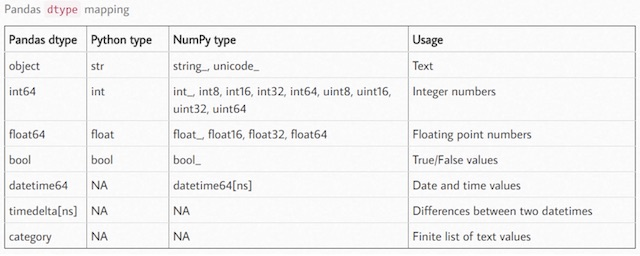

# More Transformations


**Mapping** comes in handy when performing element-wise operations and cleaning data. Let's look at chickens again, but as a dataframe:

```
>>> chickens = pd.DataFrame({'name' :['Patty', 'Tikka', 'Nugget', 'Parmesan', pd.NA, 'Noodle', 'Dumpling II']}, dtype='string')
>>> chickens
          name
0        Patty
1        Tikka
2       Nugget
3     Parmesan
4         <NA>
5       Noodle
6  Dumpling II
>>> 
```
I want to add more information about the chickens, say, primary color. So, I'll create a dict so I can add a column:

```
>>> colors = {'Patty': 'white', 'Tikka': 'orange', 'Nugget': 'white', 'Parmesan': 'yellow', pd.NA: pd.NA, 'Noodle': 'brown', 'Dumpling II': 'yellow'}
```

I can add a 'color' column by using **map**:

```
>>> chickens['color'] = chickens['name'].map(colors)
>>> chickens
          name   color
0        Patty   white
1        Tikka  orange
2       Nugget   white
3     Parmesan  yellow
4         <NA>    <NA>
5       Noodle   brown
6  Dumpling II  yellow
>>> 
```
That is a convenient and all, but map is much more powerful. Map will apply a value to any key with the same name. 

Let's create an inventory list of kitchen appliances:

```
>>> inventory = pd.DataFrame({'appliance' : ['Stove', 'microwave', 'Fridge', 'fridge', 'mixer', 'stove']}, dtype='string')
>>> inventory
   appliance
0      Stove
1  microwave
2     Fridge
3     fridge
4      mixer
5      stove
```

All stoves, fridges, mixers, and microwaves have the same price:

```
>>> prices = {'stove': 340, 'fridge': 899, 'mixer': 150, 'microwave': 79}
```

So when we map the appliances to their prices, they should match up:

```
>>> inventory['price'] = inventory['appliance'].map(prices)
>>> inventory
   appliance  price
0      Stove    NaN
1  microwave   79.0
2     Fridge    NaN
3     fridge  899.0
4      mixer  150.0
5      stove  340.0
>>> 
```

But they don't... We get some NaN values. But WHY? Oh, our prices list was in all lowercase. We can convert our appliances to lowercase so they can be properly mapped:

```
>>> inventory['price'] = inventory['appliance'].str.lower().map(prices)
>>> inventory
   appliance  price
0      Stove    340
1  microwave     79
2     Fridge    899
3     fridge    899
4      mixer    150
5      stove    340
>>> 
```

Let's look at another way to manipulate data with **.apply()** methodology, which applies a function to each column or row: 

```
>>> data
        one  two  three  four
red       0    1      2     3
blue      4    5      6     7
orange    8    9     10    11
yellow   12   13     14    15
>>> def my_func(x, a=1, b=3):
...     return x - a if x % 2 == 0 else x*2
... 
>>> data['one']
red        0
blue       4
orange     8
yellow    12
Name: one, dtype: int64
>>> data['one'].apply(my_func)
red       -1
blue       3
orange     7
yellow    11
Name: one, dtype: int64
```
Or with an anonymous, or lambda function applied to columns or rows:

```
>>> func = lambda x: x.max() - x.min()
>>> data.apply(func)
one      12
two      12
three    12
four     12
dtype: int64
>>> data.apply(func, axis='columns')
red       3
blue      3
orange    3
yellow    3
dtype: int64
>>> 
```

And **applymap()** applies whatever you'd like to element-wise to every value in the dataframe or series:

```
>>> square = lambda x: x**2
>>> data.applymap(square)
        one  two  three  four
red       0    1      4     9
blue     16   25     36    49
orange   64   81    100   121
yellow  144  169    196   225
>>> 
```


We've renamed indexes like the following:

```
>>> data = pd.DataFrame(np.arange(16).reshape((4, 4)), index=['red', 'blue', 'orange', 'yellow'], columns=['one', 'two', 'three', 'four'])
>>> data
        one  two  three  four
red       0    1      2     3
blue      4    5      6     7
orange    8    9     10    11
yellow   12   13     14    15
>>> 
>>> newindex = data.index.str.upper()
>>> newindex
Index(['RED', 'BLUE', 'ORANGE', 'YELLOW'], dtype='object')
>>> data.index = newindex
>>> data
        one  two  three  four
RED       0    1      2     3
BLUE      4    5      6     7
ORANGE    8    9     10    11
YELLOW   12   13     14    15
>>> 
```

But there is also a **replace()** method to handle it. We can customize how we want our indexes and columns:

```
>>> data = pd.DataFrame(np.arange(16).reshape((4, 4)), index=['red', 'blue', 'orange', 'yellow'], columns=['one', 'two', 'three', 'four'])
>>> data
        one  two  three  four
red       0    1      2     3
blue      4    5      6     7
orange    8    9     10    11
yellow   12   13     14    15
>>> data.rename(index=str.title, columns=str.upper)
        ONE  TWO  THREE  FOUR
Red       0    1      2     3
Blue      4    5      6     7
Orange    8    9     10    11
Yellow   12   13     14    15
>>> 
```

Or, if we need to rename an individual index or column (or as many as we need to) by passing a dict, and we've learned before the outcome of passing "inplace=True":

```
>>> data
        one  two  three  four
red       0    1      2     3
blue      4    5      6     7
orange    8    9     10    11
yellow   12   13     14    15
>>> data.rename(index={'red' : 'purple'}, columns={'four' : 'three and a half'})
        one  two  three  three and a half
purple    0    1      2                 3
blue      4    5      6                 7
orange    8    9     10                11
yellow   12   13     14                15
>>> 
>>> data.rename(index={'red' : 'purple'}, columns={'four' : 'three and a half'}, inplace=True)
>>> data
        one  two  three  three and a half
purple    0    1      2                 3
blue      4    5      6                 7
orange    8    9     10                11
yellow   12   13     14                15
>>> 
```



**Type conversion**: Once we've established the expected data in a column, we'll want to ensure that all data is of the expected type. For example, if we have a Series constructed of a mix of strings and numerics... you cannot do math on a string, so we need to convert it to a numeric. No doubt you've seen this before in your initial Python lessons, and it still applies. Expected strings need to be strings, expected numbers need to be numeric types, dates need to be date/time formatted, etc. 

Here we change a Series containing strings and numerics with **to_numeric**:

```
>>> weirdo_series = pd.Series(["80", 6.5, "7.2", 32, "0.5"])
>>> weirdo_series
0     80
1    6.5
2    7.2
3     32
4    0.5
dtype: object
>>> weirdo_series_float = pd.to_numeric(weirdo_series)
>>> weirdo_series_float
0    80.0
1     6.5
2     7.2
3    32.0
4     0.5
dtype: float64
```

Notice the dtype of the Series changes from object to float64. 

Basic usage is as follows:

```
# convert Series
my_series = pd.to_numeric(my_series)

# convert column "a" of a DataFrame
df["a"] = pd.to_numeric(df["a"])
```

When we have a column/Series that contains types that cannot be converted we can specify to ignore those values:

```
>>> hello = pd.Series(["apple jax", 6.5, "7.2", 32, "0.5", pd.NA])
>>> hello
0    apple jax
1          6.5
2          7.2
3           32
4          0.5
5         <NA>
dtype: object
>>> pd.to_numeric(hello)
Traceback (most recent call last):
  File "pandas/_libs/lib.pyx", line 2062, in pandas._libs.lib.maybe_convert_numeric
ValueError: Unable to parse string "apple jax"
During handling of the above exception, another exception occurred:
Traceback (most recent call last):
  File "<stdin>", line 1, in <module>
  File "/Users/me/miniconda3/envs/dapenv/lib/python3.8/site-packages/pandas/core/tools/numeric.py", line 154, in to_numeric
    values = lib.maybe_convert_numeric(
  File "pandas/_libs/lib.pyx", line 2099, in pandas._libs.lib.maybe_convert_numeric
ValueError: Unable to parse string "apple jax" at position 0
# parsing error; ignore errors
>>> pd.to_numeric(hello, errors='ignore')
0    apple jax
1          6.5
2          7.2
3           32
4          0.5
5         <NA>
dtype: object
>>> 
```

We can choose to "coerce" the errors, and force them to be NaN:

```
>>> pd.to_numeric(hello, errors='coerce')
0     NaN
1     6.5
2     7.2
3    32.0
4     0.5
5     NaN
dtype: float64
```

By default, conversion with to_numeric() will give you either a int64 or float64 dtype. If memory space is an issue, you might want to consider **downcasting** to specify dtypes that take up less space. 

Documentation on **to_numeric()** can be found [here](https://pandas.pydata.org/docs/reference/api/pandas.to_numeric.html#pandas.to_numeric).

By default, **convert_dtypes** will attempt to convert a Series (or each Series in a DataFrame) to datatypes (modern String or Integer types) that support pd.NA. Let's try it out. 

```
>>> frame = pd.DataFrame( {
... "a": pd.Series([1, 2, 3], dtype=np.dtype('int32')),
... "b": pd.Series([True, False, np.nan], dtype=np.dtype("O")), 
... "c": pd.Series(['a', 'b', 'c'], dtype=np.dtype("O")), 
... "d": pd.Series([np.nan, 20, 30], dtype=np.dtype("float")),})
>>> frame
   a      b  c     d
0  1   True  a   NaN
1  2  False  b  20.0
2  3    NaN  c  30.0
>>> frame.dtypes
a      int32
b     object
c     object
d    float64
dtype: object
>>> frame_converted = frame.convert_dtypes()
>>> frame_converted
   a      b  c     d
0  1   True  a  <NA>
1  2  False  b    20
2  3   <NA>  c    30
>>> frame_converted.dtypes
a      Int32
b    boolean
c     string
d      Int64
dtype: object
>>> 
```

Column 'a' was kept as int32, column 'b' was deemed to best be a boolean type, 'c' was better off as a string than an object, and 'd' was converted from float to int because it didn't contain any decimal values. Pretty neat. 

Let's look at the **groupby()** method, which allows us to create partitions of data to ready for transformation:

```
>>> frame = pd.DataFrame( {
... 'a' :['green', 'blue', 'blue', 'green'], 
... 'b' :[False, True, False, True], 
... 'c' :[20, 10, 90, 20]})
>>> frame
       a      b   c
0  green  False  20
1   blue   True  10
2   blue  False  90
3  green   True  20
>>> frame.dtypes
a    object
b      bool
c     int64
dtype: object
# convert dtypes
>>> frame.convert_dtypes()
       a      b   c
0  green  False  20
1   blue   True  10
2   blue  False  90
3  green   True  20
# hmmmm, nothing changed. cool. 
>>> frame.dtypes
a    object
b      bool
c     int64
dtype: object
# let's group by column 'a'
>>> frame.groupby(by='a')
<pandas.core.groupby.generic.DataFrameGroupBy object at 0x113060d60>
```

We can use **.groups** to get the grouping criteria:

```
>>> frame_groupa = frame.groupby(by='a')
>>> frame_groupa.groups
{'blue': [1, 2], 'green': [0, 3]}
```

Unfortunately, the groupby output doesn't print to the screen, but I can help you to visualize it:

```
group[0]:
1   blue   True  10
2   blue  False  90

group[1]:
0  green  False  20
3  green   True  20
```


We can pull out the entries by the contents in 'a' with **get_group()**:

```
>>> frame_groupa.get_group('blue')
      a      b   c
1  blue   True  10
2  blue  False  90
>>> frame_groupa.get_group('green')
       a      b   c
0  green  False  20
3  green   True  20
>>> 
```

Print first entries in all the groups formed:

```
# we have two groups, blue and green, and these are the first rows for each
>>> frame_groupa.first()
           b   c
a               
blue    True  10
green  False  20
```

We can group by more than one column:

```
>>> frame_ac = frame.groupby(by=['a', 'c'])
<pandas.core.groupby.generic.DataFrameGroupBy object at 0x113070d00>
```
In this case, we created three groups:

```
group[0]:
# a unique combination of 'a' and 'c'
1   blue   True  10

group[1]:
# a unique combination of 'a' and 'c'
2   blue  False  90

group[2]:
# has green ('a') and 20 ('c') in common, so grouped together
0  green  False  20
3  green   True  20
```
And here is how those three groups came about:

```
>>> frame_ac.groups
{('blue', 10): [1], ('blue', 90): [2], ('green', 20): [0, 3]}
```

If we are concerned about the number of groups, we can inquire:

```
>>> frame_ac.ngroups
3
>>>
```

Then we can start doing things like this, if we wanted the totals for each value in a we could return the following dataframe:

```
>>> frame
       a      b   c
0  green  False  20
1   blue   True  10
2   blue  False  90
3  green   True  20
>>> frame.groupby('a')[['c']].sum()
         c
a         
blue   100
green   40
>>> 
```
or, maybe just the Series:

```
>>> frame.groupby('a')['c'].sum()
a
blue     100
green     40
Name: c, dtype: int64
>>> 
```
(If you're confused, recall that df['x'] returns a Series and df[['x']] returns a DataFrame.)

We can call our summary statistics function, **describe()**:

```
>>> result = frame.groupby('a')['c'].describe()
>>> result
       count  mean        std   min   25%   50%   75%   max
a                                                          
blue     2.0  50.0  56.568542  10.0  30.0  50.0  70.0  90.0
green    2.0  20.0   0.000000  20.0  20.0  20.0  20.0  20.0
>>> 
```


Another way to do this is with **aggregation**, or **.agg()**. We can call agg() and pass in a basic function, such as sum:

```
>>> frame.agg(sum)
a    greenbluebluegreen
b                     2
c                   140
dtype: object
```

That is not exactly helpful, but if we've done a grouping, it is!

```
>>> frame_ac.agg(sum)
          b
a     c    
blue  10  1
      90  0
green 20  1
>>> 
```
Different variations:

```
>>> frame_ac.agg(np.sum)
          b
a     c    
blue  10  1
      90  0
green 20  1
>>> frame_groupa.agg(sum)
       b    c
a            
blue   1  100
green  1   40
>>> 
```
Or we can wrap the aggregation function inside a list to return a dataframe. Note the variations:

```
>>> frame.agg([sum])
                      a  b    c
sum  greenbluebluegreen  2  140
>>> 
>>> frame_groupa.agg([sum])
        b    c
      sum  sum
a             
blue    1  100
green   1   40
>>> frame_ac.agg(['sum'])
           b
         sum
a     c     
blue  10   1
      90   0
green 20   1
>>> 
```
We can use **agg()** to do some easy statistics function on a column:

```
>>> data
        one  two  three  four
red       0    1      2     3
blue      4    5      6     7
orange    8    9     10    11
yellow   12   13     14    15
>>> data.agg({'four' : ['sum', 'mean', 'min', 'max']})
      four
sum   36.0
mean   9.0
min    3.0
max   15.0
>>> frame
       a      b   c
0  green  False  20
1   blue   True  10
2   blue  False  90
3  green   True  20
>>> frame.agg({'c' : ['sum', 'mean', 'min', 'max']})
          c
sum   140.0
mean   35.0
min    10.0
max    90.0
>>> 
```
By default, the axis=0 with **agg()**, but we can specify axis=1:

```
>>> data
        one  two  three  four
red       0    1      2     3
blue      4    5      6     7
orange    8    9     10    11
yellow   12   13     14    15
>>> data.agg('min', axis=1)
red        0
blue       4
orange     8
yellow    12
dtype: int64
>>> data.agg('mean', axis=1)
red        1.5
blue       5.5
orange     9.5
yellow    13.5
dtype: float64
>>> 
```

The real beauty is we can pass any function of our choosing. We aren't limited to predefined functions. 

```
>>> def n_value(x, n):
...     return x.iloc[n-1]
... 
>>> data.agg(n_value, n=2)
one      4
two      5
three    6
four     7
dtype: int64
>>> 
```
Built in-line with a lambda:

```
>>> data.agg(func = lambda x, n: x.iloc[n-1], n=2)
one      4
two      5
three    6
four     7
dtype: int64
>>> 
```

