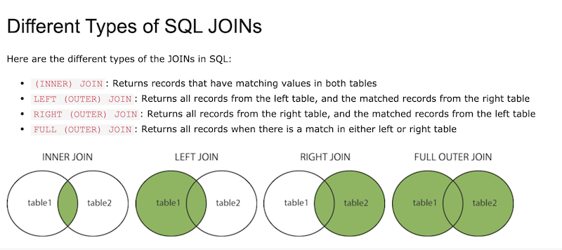

# Get in Shape!


Tonight is all about reshaping your dataframe. Sometimes you may want a different arrangement of your data for visualization purposes. Or maybe you need it in a certain format/shape in order to process it with a specific method you've written. For whatever reason, we've got the methods to cover it. 


## Transpose 

Remember **.T**? It's an accessor property to **transpose()**. We flip-flop the axes on a diagonal. Columns become rows, rows become columns.

```
>>> groceries
               Price
fruit   taste       
apples  sweet   2.30
        tart    5.43
        sour    1.20
banana  sweet   3.45
        sweet   5.23
berries tart    1.22
        sweet   2.34
        sour    2.22
```

Using transpose():

```
>>> groceries.transpose()
fruit apples            banana       berries            
taste  sweet  tart sour  sweet sweet    tart sweet  sour
Price    2.3  5.43  1.2   3.45  5.23    1.22  2.34  2.22
>>> 
```
Using .T:

```
>>> groceries.T
fruit apples            banana       berries            
taste  sweet  tart sour  sweet sweet    tart sweet  sour
Price    2.3  5.43  1.2   3.45  5.23    1.22  2.34  2.22
>>> 
```

# Melt

We use **.melt()** to transform from wide to long. 

We **could** just call .melt(), however we only have a value of "Price". We would end up with the following (seven rows for seven datapoints... fruit and taste were more of a way of organizing our table rather than datapoints):

```
>>> groceries
               Price
fruit   taste       
apples  sweet   2.30
        tart    5.43
        sour    1.20
banana  sweet   3.45
        sweet   5.23
berries tart    1.22
        sweet   2.34
        sour    2.22
>>> groceries.melt()
  variable  value
0    Price   2.30
1    Price   5.43
2    Price   1.20
3    Price   3.45
4    Price   5.23
5    Price   1.22
6    Price   2.34
7    Price   2.22
>>> 
```

Let's rebuild groceries to better demonstrate .melt() and use it to its full potential. Documentation can be found [here](https://pandas.pydata.org/pandas-docs/version/0.23/generated/pandas.DataFrame.melt.html#pandas.DataFrame.melt)

```
>>> data = [['apple', 'sweet', 2.30], ['apple', 'tart', 5.43], ['apple', 'sour', 1.20], ['banana', 'sweet', 3.45], ['banana', 'sweet', 5.23], ['berry', 'tart', 1.22], ['berry', 'sweet', 2.34], ['berry', 'sour', 2.22]]
>>> groceries2 = pd.DataFrame(data, columns = ['fruit', 'taste', 'price'])
>>> groceries2
    fruit  taste  price
0   apple  sweet   2.30
1   apple   tart   5.43
2   apple   sour   1.20
3  banana  sweet   3.45
4  banana  sweet   5.23
5   berry   tart   1.22
6   berry  sweet   2.34
7   berry   sour   2.22
>>> 
```

If we perform a straight-up melt, we get the following (one entry per datapoint):
 
 ```
 >>> groceries2.melt()
   variable   value
0     fruit   apple
1     fruit   apple
2     fruit   apple
3     fruit  banana
4     fruit  banana
5     fruit   berry
6     fruit   berry
7     fruit   berry
8     taste   sweet
9     taste    tart
10    taste    sour
11    taste   sweet
12    taste   sweet
13    taste    tart
14    taste   sweet
15    taste    sour
16    price     2.3
17    price    5.43
18    price     1.2
19    price    3.45
20    price    5.23
21    price    1.22
22    price    2.34
23    price    2.22
>>> 
 ```

The good news is that .melt() is customizable and will take arguments to help organize the data during the melting process. "id_vars" will organize per variable of fruit. Each variable will be represented once per entry per taste and per price. 

```
>>> groceries2.melt(id_vars='fruit')
     fruit variable  value
0    apple    taste  sweet
1    apple    taste   tart
2    apple    taste   sour
3   banana    taste  sweet
4   banana    taste  sweet
5    berry    taste   tart
6    berry    taste  sweet
7    berry    taste   sour
8    apple    price    2.3
9    apple    price   5.43
10   apple    price    1.2
11  banana    price   3.45
12  banana    price   5.23
13   berry    price   1.22
14   berry    price   2.34
15   berry    price   2.22
>>> 
```
Ideally, the values you would want to stack would be identified by "value\_vars", and we can name the variable and value columns. We could even omit "id\_vars" and the "fruit" column would not appear in our melt. Melt is one of those functions that can be customized, so remember to consult the documentation, as always. 


```
>>> groceries2.melt(id\_vars='fruit', value\_vars=['taste', 'price'], var\_name='abc', value\_name='xyz')
     fruit    abc    xyz
0    apple  taste  sweet
1    apple  taste   tart
2    apple  taste   sour
3   banana  taste  sweet
4   banana  taste  sweet
5    berry  taste   tart
6    berry  taste  sweet
7    berry  taste   sour
8    apple  price    2.3
9    apple  price   5.43
10   apple  price    1.2
11  banana  price   3.45
12  banana  price   5.23
13   berry  price   1.22
14   berry  price   2.34
15   berry  price   2.22
>>> 
```

# Stack and Unstack

With stack(), Pandas reshapes the DataFrame into a Series, whilst stacking the values of abc, def, and ghi within each original row-index, resulting in a 2-level multi row index. Stack also has multiple arguments and configurations, found [here](

Take the simplest of DataFrames. We get a taller version, stacked vertically: 

```
>>> df = pd.DataFrame({
... 'abc': [1, 2, 3, 4],
... 'def': [5, 6, 7, 8], 
... 'ghi': [9, 10, 11, 12]})
>>> df
   abc  def  ghi
0    1    5    9
1    2    6   10
2    3    7   11
3    4    8   12
>>> df.stack()
0  abc     1
   def     5
   ghi     9
1  abc     2
   def     6
   ghi    10
2  abc     3
   def     7
   ghi    11
3  abc     4
   def     8
   ghi    12
dtype: int64
>>> 
```
MultiIndex columns add complexity, of course: 

```
>>> rocks = pd.DataFrame(
... data=[[234,345,456,567,678,789], [987,876,765,654,543,432], [111,222,333,444,555,666]],
... index=pd.Index(['alaska', 'arkansas', 'idaho'], name='state'),
... columns=pd.MultiIndex.from_tuples([('igneous', 'obsidian'), ('igneous', 'granite'), ('sedimentary', 'shale'), ('sedimentary', 'sandstone'), ('metamorphic', 'slate'), ('metamorphic', 'jadeite')], 
... names=['type', 'subtype']))
>>> rocks
type      igneous         sedimentary           metamorphic        
subtype  obsidian granite       shale sandstone       slate jadeite
state                                                              
alaska        234     345         456       567         678     789
arkansas      987     876         765       654         543     432
idaho         111     222         333       444         555     666
>>> 
```

We can pass the column level from the MultiIndex to declare what to stack (here it is 'type' or 'subtype'). As you can see, it is common to get NaN values where there is no data. In addition, calling .stack() without any parameters returns .stack(level='subtype'). 

```
>>> rocks.stack(level='type')
subtype               granite  jadeite  obsidian  sandstone  shale  slate
state    type                                                            
alaska   igneous        345.0      NaN     234.0        NaN    NaN    NaN
         metamorphic      NaN    789.0       NaN        NaN    NaN  678.0
         sedimentary      NaN      NaN       NaN      567.0  456.0    NaN
arkansas igneous        876.0      NaN     987.0        NaN    NaN    NaN
         metamorphic      NaN    432.0       NaN        NaN    NaN  543.0
         sedimentary      NaN      NaN       NaN      654.0  765.0    NaN
idaho    igneous        222.0      NaN     111.0        NaN    NaN    NaN
         metamorphic      NaN    666.0       NaN        NaN    NaN  555.0
         sedimentary      NaN      NaN       NaN      444.0  333.0    NaN
>>> rocks.stack(level='subtype')
type                igneous  metamorphic  sedimentary
state    subtype                                     
alaska   granite      345.0          NaN          NaN
         jadeite        NaN        789.0          NaN
         obsidian     234.0          NaN          NaN
         sandstone      NaN          NaN        567.0
         shale          NaN          NaN        456.0
         slate          NaN        678.0          NaN
arkansas granite      876.0          NaN          NaN
         jadeite        NaN        432.0          NaN
         obsidian     987.0          NaN          NaN
         sandstone      NaN          NaN        654.0
         shale          NaN          NaN        765.0
         slate          NaN        543.0          NaN
idaho    granite      222.0          NaN          NaN
         jadeite        NaN        666.0          NaN
         obsidian     111.0          NaN          NaN
         sandstone      NaN          NaN        444.0
         shale          NaN          NaN        333.0
         slate          NaN        555.0          NaN
>>> 
```
You can specify multiple columns to stack on, if your MultiIndex has many columns: 

```
>>> rocks.stack(level=['type', 'subtype'])
state     type         subtype  
alaska    igneous      granite      345.0
                       obsidian     234.0
          metamorphic  jadeite      789.0
                       slate        678.0
          sedimentary  sandstone    567.0
                       shale        456.0
arkansas  igneous      granite      876.0
                       obsidian     987.0
          metamorphic  jadeite      432.0
                       slate        543.0
          sedimentary  sandstone    654.0
                       shale        765.0
idaho     igneous      granite      222.0
                       obsidian     111.0
          metamorphic  jadeite      666.0
                       slate        555.0
          sedimentary  sandstone    444.0
                       shale        333.0
dtype: float64
```

For fun, we can also unstack(). Unstack will convert your dataframe to a wide format. 

```
>>> rocks
type      igneous         sedimentary           metamorphic        
subtype  obsidian granite       shale sandstone       slate jadeite
state                                                              
alaska        234     345         456       567         678     789
arkansas      987     876         765       654         543     432
idaho         111     222         333       444         555     666
>>> rocks.stack()
type                igneous  metamorphic  sedimentary
state    subtype                                     
alaska   granite      345.0          NaN          NaN
         jadeite        NaN        789.0          NaN
         obsidian     234.0          NaN          NaN
         sandstone      NaN          NaN        567.0
         shale          NaN          NaN        456.0
         slate          NaN        678.0          NaN
arkansas granite      876.0          NaN          NaN
         jadeite        NaN        432.0          NaN
         obsidian     987.0          NaN          NaN
         sandstone      NaN          NaN        654.0
         shale          NaN          NaN        765.0
         slate          NaN        543.0          NaN
idaho    granite      222.0          NaN          NaN
         jadeite        NaN        666.0          NaN
         obsidian     111.0          NaN          NaN
         sandstone      NaN          NaN        444.0
         shale          NaN          NaN        333.0
         slate          NaN        555.0          NaN
>>> rocks.stack().unstack(level='subtype')
type     igneous                                        metamorphic                                         sedimentary                                        
subtype  granite jadeite obsidian sandstone shale slate     granite jadeite obsidian sandstone shale  slate     granite jadeite obsidian sandstone  shale slate
state                                                                                                                                                          
alaska     345.0     NaN    234.0       NaN   NaN   NaN         NaN   789.0      NaN       NaN   NaN  678.0         NaN     NaN      NaN     567.0  456.0   NaN
arkansas   876.0     NaN    987.0       NaN   NaN   NaN         NaN   432.0      NaN       NaN   NaN  543.0         NaN     NaN      NaN     654.0  765.0   NaN
idaho      222.0     NaN    111.0       NaN   NaN   NaN         NaN   666.0      NaN       NaN   NaN  555.0         NaN     NaN      NaN     444.0  333.0   NaN
>>> 
```

And that could be how you end up with NaNs all over the place. How would you go about cleaning the above DataFrame? 

# Pivot and Pivot_Table

Let's work with the below DataFrame to demonstrate pivot methods:

```
>>> xyz = pd.DataFrame({
... 'rows': ['r0', 'r1', 'r2', 'r0', 'r1', 'r2'], 
... 'columns': ['c0', 'c1', 'c2', 'c3', 'c4', 'c5'], 
... 'values': [11, 22, 33, 44, 55, 66]})
>>> xyz
  rows columns  values
0   r0      c0      11
1   r1      c1      22
2   r2      c2      33
3   r0      c3      44
4   r1      c4      55
5   r2      c5      66
>>> 
```

We can tell Pandas which columns we want to use for the index, rows, and values.

```
>>> xyz.pivot(index='rows', columns='columns', values='values')
columns    c0    c1    c2    c3    c4    c5
rows                                       
r0       11.0   NaN   NaN  44.0   NaN   NaN
r1        NaN  22.0   NaN   NaN  55.0   NaN
r2        NaN   NaN  33.0   NaN   NaN  66.0
>>> 
```
That was nice and easy, right? But what if we have repeating values? We'll get an error about not being able to reshape due to multiple entries. 

```
>>> xyz = pd.DataFrame({
... 'rows': ['r0', 'r1', 'r2', 'r0', 'r1', 'r2'], 
... 'columns': ['c0', 'c1', 'c2', 'c0', 'c1', 'c2'], 
... 'values': [11, 22, 33, 44, 55, 66]})
>>> xyz
  rows columns  values
0   r0      c0      11
1   r1      c1      22
2   r2      c2      33
3   r0      c0      44
4   r1      c1      55
5   r2      c2      66
>>> xyz.pivot(index='rows', columns='columns', values='values')
Traceback (most recent call last):
  File "<stdin>", line 1, in <module>
  File "/Users/melissapabst/miniconda3/envs/dapenv/lib/python3.8/site-packages/pandas/core/frame.py", line 6876, in pivot
    return pivot(self, index=index, columns=columns, values=values)
  File "/Users/melissapabst/miniconda3/envs/dapenv/lib/python3.8/site-packages/pandas/core/reshape/pivot.py", line 461, in pivot
    return indexed.unstack(columns)
  File "/Users/melissapabst/miniconda3/envs/dapenv/lib/python3.8/site-packages/pandas/core/series.py", line 3799, in unstack
    return unstack(self, level, fill_value)
  File "/Users/melissapabst/miniconda3/envs/dapenv/lib/python3.8/site-packages/pandas/core/reshape/reshape.py", line 430, in unstack
    unstacker = _Unstacker(
  File "/Users/melissapabst/miniconda3/envs/dapenv/lib/python3.8/site-packages/pandas/core/reshape/reshape.py", line 118, in __init__
    self._make_selectors()
  File "/Users/melissapabst/miniconda3/envs/dapenv/lib/python3.8/site-packages/pandas/core/reshape/reshape.py", line 167, in _make_selectors
    raise ValueError("Index contains duplicate entries, cannot reshape")
ValueError: Index contains duplicate entries, cannot reshape
```
In this case, we will have to use the 'aggfunc' argument. It specifies a list to hold values that have the same row and column values.

```
>>> xyz = pd.DataFrame({
... 'rows': ['r0', 'r1', 'r2', 'r0', 'r1', 'r2'], 
... 'columns': ['c0', 'c1', 'c2', 'c0', 'c1', 'c2'], 
... 'values': [11, 22, 33, 44, 55, 66]})
>>> xyz.pivot_table(index='rows', columns='columns', values='values', aggfunc=list)
columns        c0        c1        c2
rows                                 
r0       [11, 44]       NaN       NaN
r1            NaN  [22, 55]       NaN
r2            NaN       NaN  [33, 66]
>>> 
```
If we don't want it as a list, we could always use any aggregation function. Let's try with sum:

```
>>> xyz.pivot_table(index='rows', columns='columns', values='values', aggfunc='sum')
columns    c0    c1    c2
rows                     
r0       55.0   NaN   NaN
r1        NaN  77.0   NaN
r2        NaN   NaN  99.0
```
Or as many aggfuncs as you'd like. Here we have sum and mean:

```
>>> xyz.pivot_table(index='rows', columns='columns', values='values', aggfunc=['sum', 'mean'])
          sum              mean            
columns    c0    c1    c2    c0    c1    c2
rows                                       
r0       55.0   NaN   NaN  27.5   NaN   NaN
r1        NaN  77.0   NaN   NaN  38.5   NaN
r2        NaN   NaN  99.0   NaN   NaN  49.5
>>> 
```

Pivot tables will come in handy! You can specify multiple index rows, columns, values... it will depend on the data you have and how you need it to look. 

Wanna see something crazy? Also, I'm sorry but I misspelled "reeses"... I guess I owe you a bag now. 

```
>>> abc = pd.DataFrame({
... 'blah1': ['AA', 'BB', 'BB', 'BB', 'AA', 'BB'], 
... 'BLAH2': ['A', 'B', 'A', 'A', 'B', 'B'],
... 'duh1': ['candy', 'candy', 'candy', 'vegetable', 'vegetable', 'vegetable'], 
... 'DUH2': ['skittle', 'reeces', 'm&m', 'turnip', 'radish', 'leek'], 
... 'values1': [11, 11, 11, 33, 33, 33], 
... 'VALUES2': [1111, 2222, 3333, 4444, 5555, 6666]})
>>> ABC
Traceback (most recent call last):
  File "<stdin>", line 1, in <module>
NameError: name 'ABC' is not defined
>>> abc
  blah1 BLAH2       duh1     DUH2  values1  VALUES2
0    AA     A      candy  skittle       11     1111
1    BB     B      candy   reeces       11     2222
2    BB     A      candy      m&m       11     3333
3    BB     A  vegetable   turnip       33     4444
4    AA     B  vegetable   radish       33     5555
5    BB     B  vegetable     leek       33     6666
>>> abc.pivot_table(
... index=['blah1', 'BLAH2'],
... columns=['duh1', 'DUH2'], 
... values=['values1', 'VALUES2'], 
... aggfunc=['sum', 'count'])
                sum                                                                             ...   count                                                                       
            VALUES2                                           values1                           ... VALUES2                         values1                                       
duh1          candy                 vegetable                   candy                vegetable  ...   candy vegetable                 candy                vegetable              
DUH2            m&m  reeces skittle      leek  radish  turnip     m&m reeces skittle      leek  ... skittle      leek radish turnip     m&m reeces skittle      leek radish turnip
blah1 BLAH2                                                                                     ...                                                                               
AA    A         NaN     NaN  1111.0       NaN     NaN     NaN     NaN    NaN    11.0       NaN  ...     1.0       NaN    NaN    NaN     NaN    NaN     1.0       NaN    NaN    NaN
      B         NaN     NaN     NaN       NaN  5555.0     NaN     NaN    NaN     NaN       NaN  ...     NaN       NaN    1.0    NaN     NaN    NaN     NaN       NaN    1.0    NaN
BB    A      3333.0     NaN     NaN       NaN     NaN  4444.0    11.0    NaN     NaN       NaN  ...     NaN       NaN    NaN    1.0     1.0    NaN     NaN       NaN    NaN    1.0
      B         NaN  2222.0     NaN    6666.0     NaN     NaN     NaN   11.0     NaN      33.0  ...     NaN       1.0    NaN    NaN     NaN    1.0     NaN       1.0    NaN    NaN

[4 rows x 24 columns]
>>> 
```

## Join

You'll learn a lot more about joins in Unit 3, but here is a brief intro to the Pandas .join() method:. 

The .join() method takes two dataframes and joins them on their indexes. They are styled after SQL joins, which are used on SQL datatables. 

The four different types of joins are below, and the documentation is [here](https://pandas.pydata.org/pandas-docs/stable/reference/api/pandas.DataFrame.join.html).



## Crosstab


## Combine


## Rearrange