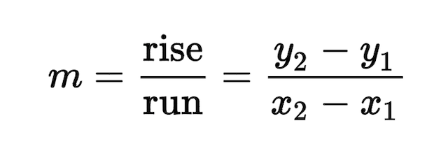
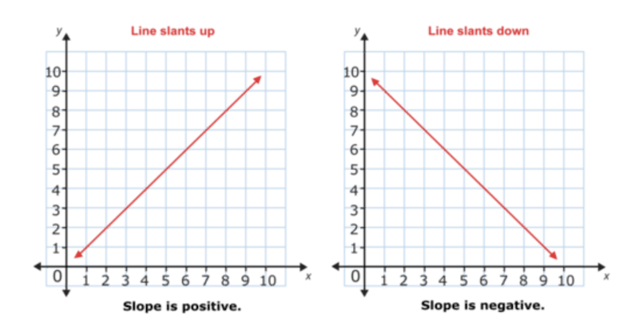
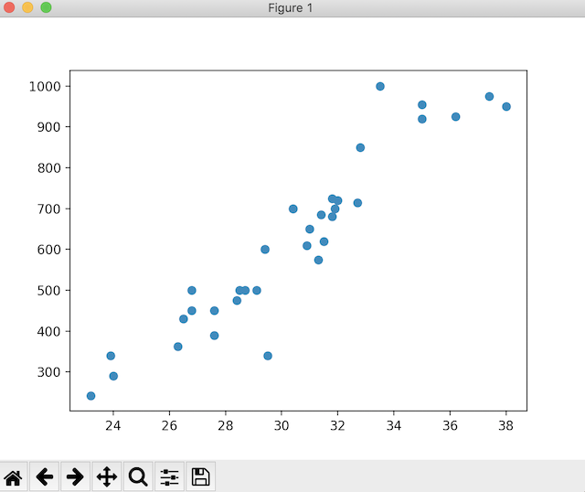
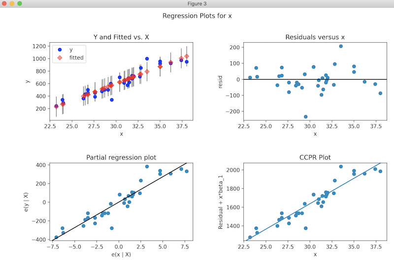

# Linear Regression

## What's my line?

Linear regression is all about finding a model that summarizes a "line" (hence, "linear") that is the best fit for the data.

Let's give **line** a backstory. 

You probably remember the formula for a straight line from algebra:

```
y = mx + b
```
Where 'y' is the response variable, and 'x' is the predictor variable. And then 'm' is the slope, and 'b' is the y-intercept, or where the line would hit the y axis if x=0 (Think about it... if x=0, the m*0 = 0. So you're left with y=b).

You might also see it written in statistics as:

```
y = bx + a
```

**Slope** is defined as the change in y divided by the change in x, or maybe 'rise over run' sounds more familiar to you: 



With the above equation, y = mx + b, we have a positive slope, which means the line slopes upwards, from left to right. 

And if the slope is negative:

```
y = b - mx
```

...Then the line slopes downward from left to right. 



The predicted/dependent 'y' value is dependent on the independent 'x' value.  

The line is a simple linear regression function, dependent on one variable. Of course, linear regression can be of multiple variables, with as many types of values as you want.

For an example of simple linear regression, take the equation for converting to Farenheit(F) from Celsius(C):

```
F = (9/5)C + 32
```
(As a former chemist, that one has been hanging around in my head for far too long!)

What are some examples of linear equations (straight-lines) you can come up with? 

[Hint](https://www.statology.org/linear-regression-real-life-examples/)


## But what is linear regression?

With linear regression, we find the best linear equation that would (use your imagination) allow us to draw a straight line down the data. Consider a scatter plot. You're plotting the value where if x equals so and so, then the y value is something and you put a dot there. Well, in a scatter plot, your dots aren't connected and no relationship is showing. We're looking to establish the relationship between our data points with a descriptive (or even predictive) mathematical model. We're going to have an equation that allows us to predict the output (y) given an input (x).  

Linear regression operates on the **ordinary least squares** method (OLS), or you may see it as **sum of least squares** method, which aims to make the total of the squares of the errors as small as possible. If you are interested in the mathematics behind the modeling process, I highly recommend you look at [this tutorial](https://www.mathsisfun.com/data/least-squares-regression.html). I can really appreciate the visual with the springs connecting the regression line to the data points!

OLS operates on **linear** data... A linear relationship has to exist. If it doesn't, then linear regression isn't the correct model to explain your data.


## R^2

In linear regression, we will see the R-squared value, or coefficient of determination. The "goodness-of-fit" measure. It is the percentage of the variance in the dependent variables, and measures the strength between your model and dependent variables. 

R-squared is reported on a 0-100% scale, usually seen as a decimal (For instance, 0.9939, which is ~99%, so... very close to 1, and very close to 100%). 

If the value is closer to zero, then the model does not do a good job of explaining variation. If it is closer to 1, the the model did a better job of explaining variation. 

That is a very simplistic overview, and if you want to read more about it, [here is a very good explanation](https://statisticsbyjim.com/regression/interpret-r-squared-regression/) about how to interpret R-squared values. Scroll down to the plots under the "Visual Representation of R-squared" section. If you can understand the pictoral version of an R-squared value of 0.15 vs. and R-squared value of 0.85, then you're good to go! 

It's really, "How close was my data to the model?"

That also is a good item to read as it goes on to explain how R-squared values aren't always straightforward. 

And also, if you are using linear regression with more than one variable, you want to use the **adjusted r-squared value**, which takes all variables into account. 

## statsmodels

We have a python module to help us out! It's called [statsmodels](https://www.statsmodels.org/devel/index.html). 

[Please download and install](https://www.statsmodels.org/devel/install.html). 

It's built on everything we love... NumPy, matplotlib... And lucky for us it contains the math we need to do linear regression.  

The documentation is [here](https://www.statsmodels.org/stable/api.html). We will be using [OLS](https://www.statsmodels.org/stable/generated/statsmodels.regression.linear_model.OLS.html#statsmodels.regression.linear_model.OLS)


## Por Ejemplo

Let's work with Fish.csv, which is a weight/length/height/width table for different species of fish. This dataset is optimized for multiple linear regression, and the example work process for that is [here](https://www.kaggle.com/aungpyaeap/fish-market). We are going to work with weight and length1 of 'bream' fish to produce a simple linear regression. 

Standard imports:

```
>>> import numpy as np
>>> import pandas as pd
>>> import seaborn as sns
>>> import matplotlib.pyplot as plt
```

```
# use pandas to import csv
>>> fishdata = pd.read_csv('PracticeFiles/Fish.csv')
# use .loc to select the bream rows to narrow our df
>>> breamdata = fishdata.loc[fishdata['Species']=='Bream']
>>> breamdata
   Species  Weight  Length1  Length2  Length3   Height   Width
0    Bream   242.0     23.2     25.4     30.0  11.5200  4.0200
1    Bream   290.0     24.0     26.3     31.2  12.4800  4.3056
2    Bream   340.0     23.9     26.5     31.1  12.3778  4.6961
3    Bream   363.0     26.3     29.0     33.5  12.7300  4.4555
4    Bream   430.0     26.5     29.0     34.0  12.4440  5.1340
5    Bream   450.0     26.8     29.7     34.7  13.6024  4.9274
6    Bream   500.0     26.8     29.7     34.5  14.1795  5.2785
7    Bream   390.0     27.6     30.0     35.0  12.6700  4.6900
8    Bream   450.0     27.6     30.0     35.1  14.0049  4.8438
9    Bream   500.0     28.5     30.7     36.2  14.2266  4.9594
10   Bream   475.0     28.4     31.0     36.2  14.2628  5.1042
11   Bream   500.0     28.7     31.0     36.2  14.3714  4.8146
12   Bream   500.0     29.1     31.5     36.4  13.7592  4.3680
13   Bream   340.0     29.5     32.0     37.3  13.9129  5.0728
14   Bream   600.0     29.4     32.0     37.2  14.9544  5.1708
15   Bream   600.0     29.4     32.0     37.2  15.4380  5.5800
16   Bream   700.0     30.4     33.0     38.3  14.8604  5.2854
17   Bream   700.0     30.4     33.0     38.5  14.9380  5.1975
18   Bream   610.0     30.9     33.5     38.6  15.6330  5.1338
19   Bream   650.0     31.0     33.5     38.7  14.4738  5.7276
20   Bream   575.0     31.3     34.0     39.5  15.1285  5.5695
21   Bream   685.0     31.4     34.0     39.2  15.9936  5.3704
22   Bream   620.0     31.5     34.5     39.7  15.5227  5.2801
23   Bream   680.0     31.8     35.0     40.6  15.4686  6.1306
24   Bream   700.0     31.9     35.0     40.5  16.2405  5.5890
25   Bream   725.0     31.8     35.0     40.9  16.3600  6.0532
26   Bream   720.0     32.0     35.0     40.6  16.3618  6.0900
27   Bream   714.0     32.7     36.0     41.5  16.5170  5.8515
28   Bream   850.0     32.8     36.0     41.6  16.8896  6.1984
29   Bream  1000.0     33.5     37.0     42.6  18.9570  6.6030
30   Bream   920.0     35.0     38.5     44.1  18.0369  6.3063
31   Bream   955.0     35.0     38.5     44.0  18.0840  6.2920
32   Bream   925.0     36.2     39.5     45.3  18.7542  6.7497
33   Bream   975.0     37.4     41.0     45.9  18.6354  6.7473
34   Bream   950.0     38.0     41.0     46.5  17.6235  6.3705
>>> 
```
Looks like we don't have any missing values. 

Here's our summary stats:

```
>>> breamdata.describe()
            Weight    Length1    Length2    Length3     Height      Width
count    35.000000  35.000000  35.000000  35.000000  35.000000  35.000000
mean    617.828571  30.305714  33.108571  38.354286  15.183211   5.427614
std     209.205709   3.593699   3.911925   4.157866   1.964707   0.721509
min     242.000000  23.200000  25.400000  30.000000  11.520000   4.020000
25%     462.500000  28.000000  30.350000  35.650000  13.958900   4.943400
50%     610.000000  30.400000  33.000000  38.500000  14.954400   5.280100
75%     717.000000  31.950000  35.000000  40.750000  16.360900   6.071600
max    1000.000000  38.000000  41.000000  46.500000  18.957000   6.749700
>>> 
```

Let's do a rough scatter plot:

```
>>> x = breamdata['Length1']
>>> y = breamdata['Weight']
>>> plt.scatter(x, y)
<matplotlib.collections.PathCollection object at 0x129c11880>
>>> plt.show()
```

Our scatter plot does indeed show there is a linear relationship: Weight (y) does depend on length (x) in a linear way. 



So now we need to find a line equation that best expresses the relationship.

```
>>> import statsmodels.formula.api as smf
>>> x = breamdata['Length1']
>>> y = breamdata['Weight']
>>> breammodel = smf.ols(formula="y ~ x", data=breamdata)
>>> breamfit = breammodel.fit()
```
We can use ".params" or ".rsquared" to get attributes of our fit equation:

```
>>> breamfit.params
Intercept   -1035.347565
x              54.549981
dtype: float64
>>> breamfit.rsquared
0.8780627095147174
```
And .summary() will show us allllll the goodies. 

```
>>> breamfit.summary()
<class 'statsmodels.iolib.summary.Summary'>
"""
                            OLS Regression Results                            
==============================================================================
Dep. Variable:                      y   R-squared:                       0.878
Model:                            OLS   Adj. R-squared:                  0.874
Method:                 Least Squares   F-statistic:                     237.6
Date:                Mon, 14 Jun 2021   Prob (F-statistic):           1.22e-16
Time:                        18:59:35   Log-Likelihood:                -199.35
No. Observations:                  35   AIC:                             402.7
Df Residuals:                      33   BIC:                             405.8
Df Model:                           1                                         
Covariance Type:            nonrobust                                         
==============================================================================
                 coef    std err          t      P>|t|      [0.025      0.975]
------------------------------------------------------------------------------
Intercept  -1035.3476    107.973     -9.589      0.000   -1255.020    -815.676
x             54.5500      3.539     15.415      0.000      47.350      61.750
==============================================================================
Omnibus:                        7.314   Durbin-Watson:                   1.478
Prob(Omnibus):                  0.026   Jarque-Bera (JB):               10.857
Skew:                          -0.252   Prob(JB):                      0.00439
Kurtosis:                       5.682   Cond. No.                         263.
==============================================================================

Notes:
[1] Standard Errors assume that the covariance matrix of the errors is correctly specified.
"""
>>> 
```

From there, we can craft our line equation: 

y = 54.5500x + (-1035.3476) or 

weight = 54.550*length - 1035.3476

And of course, we have plots!

```
>>> import statsmodels.api as sm
>>> fig = sm.graphics.plot_regress_exog(breamfit, "x")
>>> fig.tight_layout(pad=1.0)
>>> plt.show()
```



Things to note:

1. We didn't have a great R-squared value. That is likely because we didn't look for outliers, etc. 

2. I actually took the data from [this data set](https://www.kaggle.com/aungpyaeap/fish-market/), so when you are ready to go more in-depth with statistics and such, there is a section where people have submitted their own attempts at analysis. You'll see examples of cleaning data, eliminating outliers, different plots, different ways of reading the data, etc. And also multiple linear regression, with multiple variables. What we did above was with a single dependent variable. 

If we had a larger dataset, how would be check for null values? Data types? Unique values? Value counts? What would a box plot tell us? A histogram? 

Those are just several methods you might see in data analysis. I encourage you to find examples online and walk yourselves through them to understand the data analysis process. 

[A good tutorial](https://statsmaths.github.io/stat289-f18/solutions/tutorial15-statsmodels.html)

## scikit-learn

There's another tool you will see often. It's called [scikit-learn](https://scikit-learn.org/stable/index.html). It's more for machine-learning and predictive modeling. (By the way.. we're installing and using a lot of modules required for AI/machine learning, so if that is something that interests you, then go for it!)

[Download and install, here if you are interested in using it](https://scikit-learn.org/stable/install.html#installation-instructions). 

It's built on everything we love... NumPy, matplotlib... And lucky for us it contains the math we need to do linear regression.  

The documentation is [here](http://scikit-learn.org/stable/modules/generated/sklearn.linear_model.LinearRegression.html)

It's perfectly fine to use for linear regression, but I chose statsmodel to demonstrate because I loved the .summary() method. In unit 3, you will see these kinds of numbers when you do linear regression, so you are a little bit prepared. 

