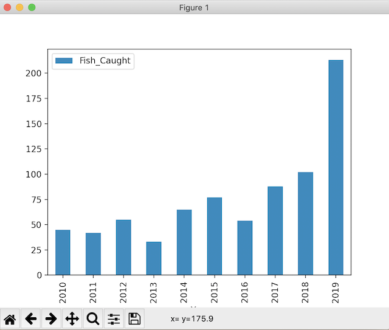

# Plot-Thirsty

I heard the class was plot-thirsty. My recommendation is to read a book or two!

Even book plots have plots...
 

 
Waaaaaaay back in Week 1, Night 4 we introduced Matplotlib. It's okay if you haven't practiced a lot with it. This module should give you a brief overview of a few kinds of common plots so you will be comfortable doing it when the time comes.  

So... I think if you were using Jupyter you can use interactive plotting with:

```
%matplotlib notebook
```
And if not, remember to import it:

```
import matplotlib.pyplot as plt
```
But I do want to mention this module was NOT created with Jupyter, but with the python shell, so there might be differences in commands. 

## Simple line plot

For a quick warm-up, let's plot a simple Numpy line:

```
>>> data = np.arange(10)
>>> data
array([0, 1, 2, 3, 4, 5, 6, 7, 8, 9])
>>> plt.plot(data)
[<matplotlib.lines.Line2D object at 0x11f39e100>]
>>> plt.show()
```


## Figure Objects

Plots within Matplotlib reside within a "Figure" object. 

```
>>> fig = plt.figure()
>>> ax1 = fig.add_subplot(2, 2, 1)
>>> ax2 = fig.add_subplot(2, 2, 2)
>>> ax3 = fig.add_subplot(2, 2, 4)
>>> plt.show()
```
What we've done is create a blank 2 X 2 matplotlib figure (2x2 indicates the figure holds 4 subplots) with three subplots, and we designated each a quadrant position of 1, 2, and 4. 


And when we add a plot to a figure, the plot goes into the last subplot.

```
>>> fig = plt.figure()
>>> ax1 = fig.add_subplot(2, 2, 1)
>>> ax2 = fig.add_subplot(2, 2, 2)
>>> ax3 = fig.add_subplot(2, 2, 4)
>>> plt.plot(np.random.rand(25).cumsum())
[<matplotlib.lines.Line2D object at 0x12cc36ac0>]
>>> plt.show())
```


Let's add to the other subplots. Don't worry about all the parameters and customizations, yet. The objects we created with fig.add_subplot are called "AxesSubplot" objects and you can call methods on their instances. 

```
>>> fig = plt.figure()
>>> ax1 = fig.add_subplot(2, 2, 1)
>>> ax2 = fig.add_subplot(2, 2, 2)
>>> ax3 = fig.add_subplot(2, 2, 4)
>>> plt.plot(np.random.rand(25).cumsum())
[<matplotlib.lines.Line2D object at 0x12dcf11f0>]
>>> ax1.hist(np.random.rand(25), bins=20, color='k', alpha=0.3)
(array([1., 2., 0., 4., 1., 1., 2., 3., 0., 1., 1., 0., 0., 1., 2., 1., 1.,
       2., 0., 2.]), array([0.04311005, 0.09065546, 0.13820087, 0.18574628, 0.23329169,
       0.2808371 , 0.32838252, 0.37592793, 0.42347334, 0.47101875,
       0.51856416, 0.56610957, 0.61365498, 0.66120039, 0.7087458 ,
       0.75629121, 0.80383663, 0.85138204, 0.89892745, 0.94647286,
       0.99401827]), <BarContainer object of 20 artists>)
>>> ax2.scatter(np.arange(25), np.arange(25) + 5)
<matplotlib.collections.PathCollection object at 0x12dcf1430>
>>> plt.show()
```


So now we have a histogram, a scatter plot, and a line plot. 

Additionally, we can create a figure without defining the subplot objects: 

```
>>> fig, axes = plt.subplots(2,3)
>>> axes
array([[<AxesSubplot:>, <AxesSubplot:>, <AxesSubplot:>],
       [<AxesSubplot:>, <AxesSubplot:>, <AxesSubplot:>]], dtype=object)
>>> plt.show()
```


It's kinda scrunchy, so I'd recommend adjusting the spacing with subplots\_adjust: 

It takes the params left, bottom, right, top, wspace, and hspace. 

An example:
plt.subplots_adjust(left=0.125,
                    bottom=0.1, 
                    right=0.9, 
                    top=0.9, 
                    wspace=0.2, 
                    hspace=0.35)
                    
wspace and hspace specify the space reserved between Matplotlib subplots. They are the fractions/percentages of axis width and height, respectively.

left, right, top and bottom parameters specify four sides of the subplots’ positions. They are the fractions of the width and height of the figure.

This will remove all whitespace between the plots: 

```
# create our figure
>>> fig, axes = plt.subplots(2,3)
# plot all six with a function
>>> for i in range(2):
...     for j in range(3):
...             axes[i,j].hist(np.random.randn(250), bins=50, color='k', alpha=0.5)
... 
# set percentages to 0
>>> plt.subplots_adjust(wspace=0, hspace=0)
>>> plt.show()
```


How you space your subplots is up to you and will depend on the situation.

We used bins with [histogram plotting](https://matplotlib.org/stable/api/_as_gen/matplotlib.pyplot.hist.html)... I don't want to gloss over it:

If bins is an integer, it defines the number of equal-width bins in the range.

If bins is a sequence, it defines the bin edges, including the left edge of the first bin and the right edge of the last bin. 

And alpha was to adjust the transparency. Matplotlib allows you to adjust the transparency of a graph plot using the alpha attribute.

By default, alpha=1

If you want to make the graph plot more transparent, then you can make alpha less than 1, such as 0.5 or 0.25.

If you want to make the graph plot less transparent, then you can make alpha greater than 1. This solidifies the graph plot, making it less transparent and more thick and dense, so to speak.

# Styles

All the ins and outs of styling your plots can be found [here](https://matplotlib.org/stable/api/_as_gen/matplotlib.pyplot.plot.html)

**Colors**: Some color abbreviations are provided for common colors('g' is green, 'k' is black, 'b' is blue, 'r' is red, etc.), but any color is available through a [HEX code](https://imagecolorpicker.com/en). 

**Markers**: This is the little mark you use to mark a data point. There are many markers in the documentation.

**Line styles**: Lines are how we connect the markers, and below are the options. 


The convention for declaring a style is as follows:

**fmt = '[marker][line][color]'**
 
So if we wanted green circles with a straight line, it would look like "o-g".

And when we go to use that in our plot, with y versus x:

ax.plot(x, y, 'o-g")

or 

ax.plot(x, y, linestyle='solid', color='g', marker='o')

```
>>> plt.plot(np.random.randn(25).cumsum(), 'o-g')
[<matplotlib.lines.Line2D object at 0x139e925b0>]
>>> plt.show()
```
And now we have a plot with green circles, connected with solid lines:


## Ticks and Labels and Legends, oh my! (And titles!)

xlim: controls x plot range
ylim: controls y plot range

Calling plt.xlim() would return the current x-axis plotting range, while calling plt.xlim([1, 10]) sets the x-axis range of 1-10. 

Discuss... What is a **tick**???

xticks/yticks: Use set\_xticks/set\_yticks to tell matplotlib where to place ticks.

xticklabels/yticklabels: We can label the ticks with set\_xticklabels or set_yticklabels.

```
>>> fig = plt.figure()
>>> ax = fig.add_subplot(1, 1, 1)
>>> ax.plot(np.random.rand(2000).cumsum())
[<matplotlib.lines.Line2D object at 0x134e5eee0>]
>>> ticks = ax.set_xticks([0, 500, 1000, 1500, 2000])
>>> labels = ax.set_xticklabels(['zero', '5-hundo', 'a grand', '1.5 grand', '2 grand'])
>>> ax.set_title('We made a plot with some ticks, labels, and title!')
Text(0.5, 1.0, 'We made a plot with some ticks, labels, and title!')
>>> ax.set_xlabel('PROFIT')
Text(0.5, 0, 'PROFIT')
>>> plt.show()
```
With a little code, we can make something look like this: 


If we plot multiple trends on the same subplot, we might want a legend to distinguish the lines. Use ax.legend(). 

```
>>> fig = plt.figure()
>>> ax = fig.add_subplot(1, 1, 1)
>>> ax.plot(np.random.rand(50).cumsum(), 'b', label='uno')
[<matplotlib.lines.Line2D object at 0x1469aa0a0>]
>>> ax.plot(np.random.rand(50).cumsum(), 'g--', label='dos')
[<matplotlib.lines.Line2D object at 0x1469aa400>]
>>> ax.plot(np.random.rand(50).cumsum(), 'or', label='tres')
[<matplotlib.lines.Line2D object at 0x1469aa790>]
>>> ax.legend(loc='best')
<matplotlib.legend.Legend object at 0x14699ff10>
>>> plt.show()
```


If you ever want to save a plot, you can do it like this: 

```
>>> plt.savefig('legendary.svg')
# or 
>>> plt.savefig('legendary.pdf')
```
Of course, there are options for saving if you look in the documenation


Your data set will dictate how you dress and design your plots. See documentation for more possibilities. Heck, there are glorious--GLORIOUS--tutorials out there! If it's something you can do in Excel or Tableau, I'm willing to bet there is a way to do it with Matplotlib or another plotting library, such as Seaborn. 

[Here are some tutorials to try](https://matplotlib.org/stable/tutorials/index.html), as well as a bunch of [example plots](https://matplotlib.org/stable/gallery/index.html) to inspire you. Challenge yourself to do at least 3 that appeal to you! Share your results with your classmates. Let's see who can come up with some funky plots. 


## Popular Plots with Pandas 

We use **.plot()** on a DataFrame (or Series!) and borrow plt.show() from Matplotlib.

.plot() has several optional parameters. Most notably, the "kind" parameter accepts eleven different string values (default is kind="line") and determines which kind of plot you’ll create:

"area" is for area plots.
"bar" is for vertical bar charts.
"barh" is for horizontal bar charts.
"box" is for box plots.
"hexbin" is for hexbin plots.
"hist" is for histograms.
"kde" is for kernel density estimate charts.
"density" is an alias for "kde".
"line" is for line graphs.
"pie" is for pie charts.
"scatter" is for scatter plots.

A common syntax to draw a plot from a DataFrame is like this:

df.plot(x="x column", y="y column", kind="line")


### Scatter Diagram

Scatter plots are used to depict a relationship between two variables.

```
>>> data = {'Acceleration_Rate': [1.2, 1.34, 1.22, 1.56, 3.0, 2.55, 1.1, 1.21],
... 'Speed': [34, 64, 77, 22, 86, 56, 44, 21]}
>>> df = pd.DataFrame(data, columns=['Acceleration_Rate', 'Speed'])
>>> df.plot(x = 'Acceleration_Rate', y = 'Speed', kind='scatter')
<AxesSubplot:xlabel='Acceleration_Rate', ylabel='Speed'>
>>> plt.show()
```
I don't really see any correlation between the data here, do you? 


### Line

Line charts are often used to display trends. We'll use time for an example.

Let's see how much better we got at fishing: 

```
>>> data = {'Year': [2010, 2011, 2012, 2013, 2014, 2015, 2016, 2017, 2018, 2019],
... 'Fish_Caught': [45, 42, 55, 33, 65, 77, 54, 88, 102, 213]}
>>> df = pd.DataFrame(data, columns=['Year', 'Fish_Caught'])
>>> df.plot(x='Year', y='Fish_Caught', kind='line')
<AxesSubplot:xlabel='Year'>
>>> plt.show()
```
Dang! I would have thought fishing would have been a pandemic-safe hobby, but we didn't go in 2020. 


Note: As an alternative to passing strings to the "kind" parameter of .plot(), DataFrame objects have several methods that you can use to create the various kinds of plots described above:

.area()

.bar()

.barh()

.box()

.hexbin()

.hist()

.kde()

.density()

.line()

.pie()

.scatter()

### Histogram

So, for a [histogram](https://pandas.pydata.org/pandas-docs/stable/reference/api/pandas.DataFrame.plot.hist.html), which gives us an overview of our dataset and is a representation of the distribution of data, we could do the following:

```
>>> plt.show()
>>> df = pd.DataFrame(data, columns=['Year', 'Fish_Caught'])
>>> ax = df.plot.hist(bins=10, alpha=0.5)
>>> plt.show()
```


```
>>> df = pd.DataFrame(data, columns=['Year', 'Fish_Caught'])
>>> df.hist(bins=10, alpha=0.5)
array([[<AxesSubplot:title={'center':'Year'}>,
        <AxesSubplot:title={'center':'Fish_Caught'}>]], dtype=object)
>>> plt.show()
```


Notice the difference between df.hist() and df.plot.hist(). They do different things; df.hist() will produce a separate plot for each Series while df.plot.hist() will produce a stacked single plot.

So there are df.whatever\_plot() methods and there are df.plot.whatever\_plot() methods. Pay attention to ensure you use the one you intend to use. (Hint: Use which one is more useful!).

### Bar Chart

Number of fish caught per year in bar format:

```
>>> ax=df.plot.bar(x='Year', y='Fish_Caught')
```



### Pie Chart

Fish pie, anyone?

```
>>> data = {'Year': [2010, 2011, 2012, 2013, 2014, 2015, 2016, 2017, 2018, 2019],
... 'Fish_Caught': [45, 42, 55, 33, 65, 77, 54, 88, 102, 213]}
>>> df = pd.DataFrame(data, index=[2010, 2011, 2012, 2013, 2014, 2015, 2016, 2017, 2018, 2019])
>>> ax = df.plot.pie(y='Fish_Caught', figsize=(5,5))
>>> plt.show()
```


Not too difficult. 

And you can always plot subsets of data, etc. Whatever you'd like. Just make sure to refer to the documentation, always!

A little more advanced. Let's say we want to look at the number of bathrooms per zip code (Why am I so obsessed with the bathroom situation in Sacremento?): 

```
# load our csv
>>> props = pd.read_csv('PracticeFiles/sacramento.csv')
# yep, looks good
>>> props.head()
             street        city    zip state  beds  ...         type                     sale_date  price   latitude   longitude
0      3526 HIGH ST  SACRAMENTO  95838    CA     2  ...  Residential  Wed May 21 00:00:00 EDT 2008  59222  38.631913 -121.434879
1       51 OMAHA CT  SACRAMENTO  95823    CA     3  ...  Residential  Wed May 21 00:00:00 EDT 2008  68212  38.478902 -121.431028
2    2796 BRANCH ST  SACRAMENTO  95815    CA     2  ...  Residential  Wed May 21 00:00:00 EDT 2008  68880  38.618305 -121.443839
3  2805 JANETTE WAY  SACRAMENTO  95815    CA     2  ...  Residential  Wed May 21 00:00:00 EDT 2008  69307  38.616835 -121.439146
4   6001 MCMAHON DR  SACRAMENTO  95824    CA     2  ...  Residential  Wed May 21 00:00:00 EDT 2008  81900  38.519470 -121.435768

[5 rows x 12 columns]
# crosstab() is a thing! 
>>> bathroom_counts = pd.crosstab(props['zip'], props['baths'])
# we now have a tabulation of two factors. thanks, crosstab!
>>> bathroom_counts
baths  0   1   2  3  4  5
zip                      
95603  0   0   2  3  0  0
95608  0   4  15  1  0  0
95610  0   0   5  1  1  0
95614  0   0   1  0  0  0
95619  0   0   1  0  0  0
...   ..  ..  .. .. .. ..
95838  1  11  24  1  0  0
95841  0   4   3  0  0  0
95842  0   7  14  1  0  0
95843  0   1  24  8  0  0
95864  0   3   1  1  0  0

[68 rows x 6 columns]

# here we "normalize" the data to sum to 1. We're adjusting the values to a common scale. Now no values are below zero, and none are above 1, and they represent percentages of a number of bathrooms at a specific zip code 
>>> bath_pcts = bathroom_counts.div(bathroom_counts.sum(1), axis=0)
>>> bath_pcts
baths         0         1         2         3         4    5
zip                                                         
95603  0.000000  0.000000  0.400000  0.600000  0.000000  0.0
95608  0.000000  0.200000  0.750000  0.050000  0.000000  0.0
95610  0.000000  0.000000  0.714286  0.142857  0.142857  0.0
95614  0.000000  0.000000  1.000000  0.000000  0.000000  0.0
95619  0.000000  0.000000  1.000000  0.000000  0.000000  0.0
...         ...       ...       ...       ...       ...  ...
95838  0.027027  0.297297  0.648649  0.027027  0.000000  0.0
95841  0.000000  0.571429  0.428571  0.000000  0.000000  0.0
95842  0.000000  0.318182  0.636364  0.045455  0.000000  0.0
95843  0.000000  0.030303  0.727273  0.242424  0.000000  0.0
95864  0.000000  0.600000  0.200000  0.200000  0.000000  0.0

[68 rows x 6 columns]
>>> bath_pcts.plot.bar()
<AxesSubplot:xlabel='zip'>
>>> plt.show()
```
That's not the best representation because it's so big, but it looks like 2 bathrooms is pretty popular in many of the zips. 


I zoomed in for you...


And looking at the first ten rows... What does this tell you about the listings?

```
>>> bathroom_counts = pd.crosstab(props.head(50)['zip'], props.head(50)['baths'])
>>> bath_pcts = bathroom_counts.div(bathroom_counts.sum(1), axis=0)
>>> bath_pcts.plot.bar()
<AxesSubplot:xlabel='zip'>
>>> plt.show()
```
Within the first 50 rows/listings, we only see 1-2 bathrooms. 


Feel free to slice and dice and plot different data from your DataFrames. This is what we've been training for!


# Seaborn

Let's try a new way of doing plots. This time it's with a library called **Seaborn**, and the documentation can be found [here](https://seaborn.pydata.org/).

Installation instructions are [here](https://seaborn.pydata.org/installing.html).

Which is better? Personal choice. Matplotlib and Seaborn square off [here](https://www.kdnuggets.com/2019/04/data-visualization-python-matplotlib-seaborn.html) in a cage match. 

I DID, however read that even if you choose not to use the Seaborn API, you might prefer to import Seaborn when using Matplotlib. Seaborn modifies Matplotlib's color schemes and plot styles, improving the aesthetics and readability. 

It's beautiful. Not gonna lie. 

Let's give it a go. Pretend we want to display the price per square foot per zip code. First we'll add a column to our props data for "price per square foot", which is just the price divided by square footage.  

We've imported Seaborn as "sns". 

The barplot() takes in a "data" argument, which will likely be your Pandas DataFrame from which you are pulling data.

```
>>> props.columns
Index(['street', 'city', 'zip', 'state', 'beds', 'baths', 'sq__ft', 'type',
       'sale_date', 'price', 'latitude', 'longitude'],
      dtype='object')
>>> props['price_per_sqft'] = props['price']/props['sq__ft']
>>> props.columns
Index(['street', 'city', 'zip', 'state', 'beds', 'baths', 'sq__ft', 'type',
       'sale_date', 'price', 'latitude', 'longitude', 'price_per_sqft'],
      dtype='object')
>>> sns.barplot(x='price_per_sqft', y='zip', data=props, orient='h')
<AxesSubplot:xlabel='price_per_sqft', ylabel='zip'>
>>> plt.show()
```

Is this beautiful, or what?


If you zoom in, you can see error bars, which represent 95% confidence level, if you are interested:


We can apply an additional categorical value with 'hue':

```
>>> sns.barplot(x='price_per_sqft', y='zip', hue='baths', data=props, orient='h')
```
So now we have price per square foot relative to baths. Seaborn is ridiculously powerful. It automatically picked a new color palette, background, etc. 


Not the **BEST** data representation, but you get the idea of what you can do. 

A histogram of the 'price' Series:

```
>>> props['price'].plot.hist(bins=10)
```


Much of the Seaborn plots are well-documented. I'd say as a minimum, make yourself familiar with each of these types: 

- [bar chart and horizontal bar chart](https://seaborn.pydata.org/generated/seaborn.barplot.html#seaborn.barplot)

- [blox plot](https://seaborn.pydata.org/generated/seaborn.boxplot.html#seaborn.boxplot)

- [line plot](https://seaborn.pydata.org/generated/seaborn.lineplot.html#seaborn.lineplot)

- [scatter plot](https://seaborn.pydata.org/generated/seaborn.scatterplot.html#seaborn.scatterplot)

- [histogram](https://seaborn.pydata.org/generated/seaborn.histplot.html#seaborn.histplot)

- [linear regression plot](https://seaborn.pydata.org/generated/seaborn.regplot.html#seaborn.regplot)

- creating charts with dual axis

Give yourself some practice. Find data sets and play around. Share what you learn.
When you need inspiration, or better graphical representation, you can look through the [examples gallery](https://seaborn.pydata.org/examples/index.html) to find what you need. 

### Other plotting libraries and words of wisdom

[Geopandas](https://geopandas.org/) is another library that extends pandas data structures, but has methods for when you need to plot geographical data. 

[Bokeh](https://docs.bokeh.org/en/latest/docs/reference/plotting.html) and [Plotly](https://plotly.com/) are good enough quality for web browers. If you're looking for print, stick with Matplotlib, pandas, and Seaborn. 

Seeing how pandas plotting and Seaborn are built on Matplotlab, it would be good to master those first before moving on. It all depends on your needs. 

Basic plotting is good for learning more about your data, but presenting it as a fancy graph requires a bit more effort to make it look polished and to get your point across. 

Effective data visualization is a special field, forever growing and challenging, and beneficial to telling a story!

I also want you to keep in mind that everything about these plots is customizable: fonts, font size, colors, color palettes, tick marks, grids, rotation of labels, etc. If you don't like how something looks, feel free to explore changing it. 